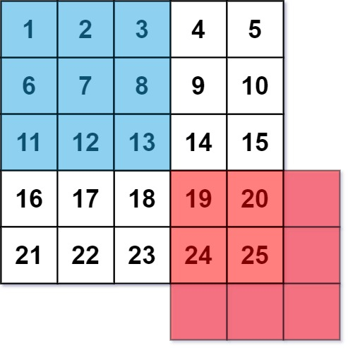

# 661 圖片平滑器

圖像平滑器 是大小為 3 x 3 的過濾器，用於對圖像的每個單元格平滑處理，平滑處理後單元格的值為該單元格的平均灰度。

每個單元格的  平均灰度 定義為：該單元格自身及其周圍的 8 個單元格的平均值，結果需向下取整。（即，需要計算藍色平滑器中 9 個單元格的平均值）。

如果一個單元格周圍存在單元格缺失的情況，則計算平均灰度時不考慮缺失的單元格（即，需要計算紅色平滑器中 4 個單元格的平均值）。



給你一個表示圖像灰度的 m x n 整數矩陣 img ，返回對圖像的每個單元格平滑處理後的圖像 。

## Image Smoother

An image smoother is a filter of the size 3 x 3 that can be applied to each cell of an image by rounding down the average of the cell and the eight surrounding cells (i.e., the average of the nine cells in the blue smoother). If one or more of the surrounding cells of a cell is not present, we do not consider it in the average (i.e., the average of the four cells in the red smoother).

[LeetCode](https://leetcode.cn/problems/image-smoother/)

### Example 1


>Input: img = [[1,1,1],[1,0,1],[1,1,1]]  
Output: [[0,0,0],[0,0,0],[0,0,0]]  
Explanation:  
For the points (0,0), (0,2), (2,0), (2,2): floor(3/4) = floor(0.75) = 0  
For the points (0,1), (1,0), (1,2), (2,1): floor(5/6) = floor(0.83333333) = 0  
For the point (1,1): floor(8/9) = floor(0.88888889) = 0  


### Constraints

* m == img.length
* n == img[i].length
* 1 <= m, n <= 200
* 0 <= img[i][j] <= 255


### C++ 


```
class Solution {
public:
    vector<vector<int>> imageSmoother(vector<vector<int>>& img) {
        /*
            使用prefix避免重覆計算
            對輸出的每一個 i及j，計算其函蓋的範圍
        */
        int&& rowNum = img.size();
        int&& colNum = img[0].size();

        vector<vector<int>> prefix(rowNum + 1, vector<int>(colNum + 1));
        for(int row = 1; row <= rowNum; ++row){
            for(int col = 1; col <= colNum; ++col)
                prefix[row][col] = prefix[row - 1][col] + prefix[row][col - 1] - prefix[row - 1][col - 1] + img[row - 1][col - 1];
        }

        //計算輸出的值
        int bottom = 0;
        int top = 0;
        int right = 0;
        int left = 0;
        for(int row = 0; row < rowNum; ++row){
            for(int col = 0; col < colNum; ++col){
                //考慮到邊界，計算實際的上下左右點
                bottom = max(0, row - 1);
                top = min(rowNum - 1, row + 1);
                right = min(colNum - 1, col + 1);
                left = max(0, col - 1);

                int&& blocks = (top - bottom + 1) * (right - left + 1);
                int&& tmpSum = prefix[top + 1][right + 1] - prefix[bottom][right + 1] - prefix[top + 1][left] + prefix[bottom][left];
                img[row][col] = tmpSum / blocks;
            }
        }

        return img;
    }
};
```