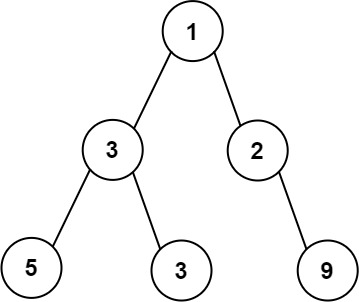

# 662 Maximum Width of Binary Tree

Given the root of a binary tree, return the maximum width of the given tree.

The maximum width of a tree is the maximum width among all levels.

The width of one level is defined as the length between the end-nodes (the leftmost and rightmost non-null nodes), where the null nodes between the end-nodes that would be present in a complete binary tree extending down to that level are also counted into the length calculation.

It is guaranteed that the answer will in the range of a 32-bit signed integer.
 
 
[LeetCode](https://leetcode.cn/problems/print-binary-tree/)

### Example 1



```
Input: root = [1,3,2,5,3,null,9]
Output: 4
Explanation: The maximum width exists in the third level with length 4 (5,3,null,9).
```

### Example 2


```
Input: root = [1,3,2,5,null,null,9,6,null,7]
Output: 7
Explanation: The maximum width exists in the fourth level with length 7 (6,null,null,null,null,null,7).
```

### Constraints

* The number of nodes in the tree is in the range [1, 3000].
* -100 <= Node.val <= 100

### C++ 

```
/**
 * Definition for a binary tree node.
 * struct TreeNode {
 *     int val;
 *     TreeNode *left;
 *     TreeNode *right;
 *     TreeNode() : val(0), left(nullptr), right(nullptr) {}
 *     TreeNode(int x) : val(x), left(nullptr), right(nullptr) {}
 *     TreeNode(int x, TreeNode *left, TreeNode *right) : val(x), left(left), right(right) {}
 * };
 */
class Solution {
protected:
    void preOrder(TreeNode*& root, int& ret, const int& id){
        if(root == nullptr)
            return;
        
        ret = max(ret, id);
        preOrder(root->right, ret, id << 1);
        preOrder(root->left, ret, (id << 1) - 1);       
    }
public:
    int widthOfBinaryTree(TreeNode* root) {
        /*
            一層一層的檢查最左邊及最右邊的遍號
            [1,null,2, null,3, null,4, null,5, null, 6, null, 7, null, 8, null, 9, null, 10]
        */
        typedef pair<TreeNode*, uint64_t> iPair;
        int ret = 1;
        deque<iPair> que;
        que.emplace_back(root, 1);

        while(que.empty() != true){
            int&& len = que.size();
            //取最左邊的點及最右的的點，計算該層的寬度
            uint64_t&& width = que.back().second - que.front().second + 1;
            ret =  width > ret? width : ret;
            //以這一層拓展出去，下一層的最右邊及最左邊點
            while(len--){
                iPair node = que.front();
                que.pop_front();
                //左子樹
                if(node.first->left != nullptr){
                    int&& pos = (node.second << 1) - 1;
                    que.emplace_back(node.first->left, pos);
                }
                //右子樹
                if(node.first->right != nullptr){
                    int&& pos = node.second << 1;
                    que.emplace_back(node.first->right, pos);
                }
            }
        }        
        
        return ret;
    }
};
```