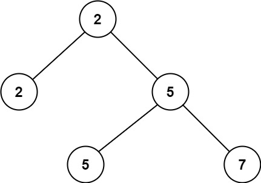

# 671 二叉樹中第二小的節點

給定一個非空特殊的二叉樹，每個節點都是正數，並且每個節點的子節點數量只能為 2 或 0。如果一個節點有兩個子節點的話，那麽該節點的值等於兩個子節點中較小的一個。

更正式地說，即 root.val = min(root.left.val, root.right.val) 總成立。

給出這樣的一個二叉樹，你需要輸出所有節點中的 第二小的值 。

如果第二小的值不存在的話，輸出 -1 。

##  Second Minimum Node In a Binary Tree

Given a non-empty special binary tree consisting of nodes with the non-negative value, where each node in this tree has exactly `two` or `zero` sub-node. If the node has two sub-nodes, then this node's value is the smaller value among its two sub-nodes. More formally, the property `root.val = min(root.left.val, root.right.val)` always holds.

Given such a binary tree, you need to output the second minimum value in the set made of all the nodes' value in the whole tree.

If no such second minimum value exists, output -1 instead.

[LeetCode](https://leetcode.cn/problems/second-minimum-node-in-a-binary-tree/)

### Example 1



> Input: root = [2,2,5,null,null,5,7]  
Output: 5  
Explanation: The smallest value is 2, the second smallest value is 5.  

### Example 2


> Input: root = [2,2,2]  
Output: -1  
Explanation: The smallest value is 2, but there isn't any second smallest value.  


### Constraints

* The number of nodes in the tree is in the range [1, 25].
* 1 <= Node.val <= 2<sup>31</sup> - 1
* root.val == min(root.left.val, root.right.val) for each internal node of the tree.

### C++ 

```
/**
 * Definition for a binary tree node.
 * struct TreeNode {
 *     int val;
 *     TreeNode *left;
 *     TreeNode *right;
 *     TreeNode() : val(0), left(nullptr), right(nullptr) {}
 *     TreeNode(int x) : val(x), left(nullptr), right(nullptr) {}
 *     TreeNode(int x, TreeNode *left, TreeNode *right) : val(x), left(left), right(right) {}
 * };
 */
class Solution {
protected:
    int first = -1;
    int second = -1;
    void dfs(TreeNode* root){
        if(root == nullptr)
            return;

        if((second == -1 && root->val > first) ||(root->val > first && root->val < second))
            second = root->val;

        dfs(root->left);
        dfs(root->right);
    }
public:
    int findSecondMinimumValue(TreeNode* root) {
        first = root->val;

        dfs(root);

        return second;
    }
};
```