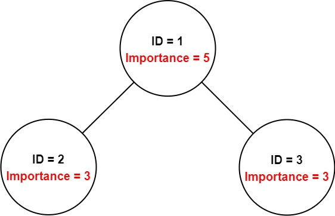

# 690 Employee Importance

You have a data structure of employee information, including the employee's unique ID, importance value, and direct subordinates' IDs.

You are given an array of employees employees where:

employees[i].id is the ID of the ith employee.
employees[i].importance is the importance value of the ith employee.
employees[i].subordinates is a list of the IDs of the direct subordinates of the ith employee.
Given an integer id that represents an employee's ID, return the total importance value of this employee and all their direct and indirect subordinates.
  
[LeetCode](https://leetcode.cn/problems/employee-importance/)

### Example 1



```
Input: employees = [[1,5,[2,3]],[2,3,[]],[3,3,[]]], id = 1
Output: 11
Explanation: Employee 1 has an importance value of 5 and has two direct subordinates: employee 2 and employee 3.
They both have an importance value of 3.
Thus, the total importance value of employee 1 is 5 + 3 + 3 = 11.
```

### Example 2


```
Input: employees = [[1,2,[5]],[5,-3,[]]], id = 5
Output: -3
Explanation: Employee 5 has an importance value of -3 and has no direct subordinates.
Thus, the total importance value of employee 5 is -3.
```

### Constraints

* 1 <= employees.length <= 2000
* 1 <= employees[i].id <= 2000
* All employees[i].id are unique.
* -100 <= employees[i].importance <= 100
* One employee has at most one direct leader and may have several subordinates.
* The IDs in employees[i].subordinates are valid IDs.

### C++ 

```
/*
// Definition for Employee.
class Employee {
public:
    int id;
    int importance;
    vector<int> subordinates;
};
*/

class Solution {
protected:
    unordered_map<int, Employee*> idMap;
    int postOrder(const int& id){
        /*
            目前員工的分數 + 及下屬的分數
        */
        int score = idMap[id]->importance;
        for(const int& subId : idMap[id]->subordinates)
            score += postOrder(subId);

        return score;
    }
public:
    int getImportance(vector<Employee*> employees, int id) {
        /*
            多叉樹，利用後序遍歷計算一個id及其子樹的分數(importance)
            需建立 id, Employee* 的map
        */

        for(const auto& data : employees)
            idMap[data->id] = data;
        
        int&& score = postOrder(id);

        return score;
    }
};
```