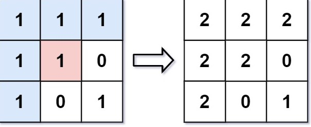

# 733 圖像渲染

有一幅以 m x n 的二維整數數組表示的圖畫 image ，其中 image[i][j] 表示該圖畫的像素值大小。

你也被給予三個整數 sr ,  sc 和 newColor 。你應該從像素 image[sr][sc] 開始對圖像進行 上色填充 。

為了完成 上色工作 ，從初始像素開始，記錄初始坐標的 上下左右四個方向上 像素值與初始坐標相同的相連像素點，接著再記錄這四個方向上符合條件的像素點與他們對應 四個方向上 像素值與初始坐標相同的相連像素點，……，重覆該過程。將所有有記錄的像素點的顏色值改為 newColor 。

最後返回 經過上色渲染後的圖像 。

##  Flood Fill

YAn image is represented by an m x n integer grid image where image[i][j] represents the pixel value of the image.

You are also given three integers sr, sc, and color. You should perform a flood fill on the image starting from the pixel image[sr][sc].

To perform a flood fill, consider the starting pixel, plus any pixels connected 4-directionally to the starting pixel of the same color as the starting pixel, plus any pixels connected 4-directionally to those pixels (also with the same color), and so on. Replace the color of all of the aforementioned pixels with color.

Return the modified image after performing the flood fill.

[LeetCode](https://leetcode.cn/problems/flood-fill/)

### Example 1



> Input: image = [[1,1,1],[1,1,0],[1,0,1]], sr = 1, sc = 1, color = 2  
Output: [[2,2,2],[2,2,0],[2,0,1]]  
Explanation: From the center of the image with position (sr, sc) = (1, 1) (i.e., the red pixel), all pixels connected by a path of the same color as the starting pixel (i.e., the blue pixels) are colored with the new color.  
Note the bottom corner is not colored 2, because it is not 4-directionally connected to the starting pixel.  

### Example 2

> Input: image = [[0,0,0],[0,0,0]], sr = 0, sc = 0, color = 0  
Output: [[0,0,0],[0,0,0]]  
Explanation: The starting pixel is already colored 0, so no changes are made to the image.  


### Constraints

* m == image.length
* n == image[i].length
* 1 <= m, n <= 50
* 0 <= image[i][j], color < 2<sup>16</sup>
* 0 <= sr < m
* 0 <= sc < n


### C++ 

```
class Solution {
public:
    vector<vector<int>> floodFill(vector<vector<int>>& image, int sr, int sc, int color) {
        if(image[sr][sc] == color)
            return image;
        /*
            使用BFS
        */
        typedef pair<int,int> iPair;
        int moves[4][2] = {{-1,0},{1,0},{0,-1},{0,1}};
        const int target = image[sr][sc];

        int&& rowNum = image.size();
        int&& colNum = image[0].size();
        image[sr][sc] = color;

        queue<iPair> que;
        que.emplace(sr,sc);

        while(que.empty() != true){
            iPair curr = que.front();
            que.pop();
            
            //拓展下一點
            for(int i = 0; i < 4; ++i){
                int&& nextRow = curr.first + moves[i][0];
                int&& nextCol = curr.second + moves[i][1];

                if(nextRow >= 0 && nextRow < rowNum && nextCol >= 0 && nextCol < colNum && image[nextRow][nextCol] == target){
                    image[nextRow][nextCol] = color;
                    que.emplace(nextRow, nextCol);
                }
            }
        }

        return image;        
    }
};
```