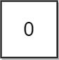

# 764 Largest Plus Sign

You are given an integer n. You have an n x n binary grid grid with all values initially 1's except for some indices given in the array mines. The ith element of the array mines is defined as mines[i] = [xi, yi] where grid[xi][yi] == 0.

Return the order of the largest axis-aligned plus sign of 1's contained in grid. If there is none, return 0.

An axis-aligned plus sign of 1's of order k has some center grid[r][c] == 1 along with four arms of length k - 1 going up, down, left, and right, and made of 1's. Note that there could be 0's or 1's beyond the arms of the plus sign, only the relevant area of the plus sign is checked for 1's.

[LeetCode](https://leetcode.cn/problems/largest-plus-sign/)

### Example 1


```
Input: n = 5, mines = [[4,2]]
Output: 2
Explanation: In the above grid, the largest plus sign can only be of order 2. One of them is shown.
```

### Example 2



```
Input: n = 1, mines = [[0,0]]
Output: 0
Explanation: There is no plus sign, so return 0.
```
 

### Constraints

* 1 <= n <= 500
* 1 <= mines.length <= 5000
* 0 <= xi, yi < n
* All the pairs (xi, yi) are unique.

### C++ 

```
class Solution {
public:
    int orderOfLargestPlusSign(int n, vector<vector<int>>& mines) {
        /*
            使用DP來紀錄到某一個位置其其相鄰的為1的最大長度
            分多次計算其上、下、左、的連續長度
        */

        unordered_set<int> mineSet;
        for (const vector<int>& mine : mines)
            mineSet.insert(mine[0] * n + mine[1]);

        vector<vector<int>> dp(n, vector<int>(n, INT_MAX));
        // 左右的最長
        int count = 0;
        for (int row = 0; row < n; ++row) {
            count = 0;
            for (int col = 0; col < n; ++col) {
                if (mineSet.count(row * n + col))
                    count = 0;
                else
                    ++count;
                dp[row][col] = min(dp[row][col], count);
            }

            count = 0;
            for (int col = n - 1; col >= 0; --col) {
                if (mineSet.count(row * n + col))
                    count = 0;
                else
                    ++count;
                dp[row][col] = min(dp[row][col], count);
            }
        }

        // 上下的最長
        int ret = INT_MIN;
        for (int col = 0; col < n; ++col) {
            count = 0;
            for (int row = 0; row < n; ++row){
                if (mineSet.count(row * n + col))
                    count = 0;
                else
                    ++count;
                dp[row][col] = min(dp[row][col], count);
            }
            count = 0;
            for(int row = n - 1; row >= 0; --row){
                if (mineSet.count(row * n + col))
                    count = 0;
                else
                    ++count;
                dp[row][col] = min(dp[row][col], count);
                ret = max(ret, dp[row][col]);
            }
        }

        return ret;
    }
};
```