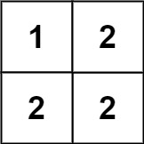

# 766 托普利茨矩陣

給你一個 m x n 的矩陣 matrix 。如果這個矩陣是托普利茨矩陣，返回 true ；否則，返回 false 。

如果矩陣上每一條由左上到右下的對角線上的元素都相同，那麽這個矩陣是 托普利茨矩陣 。

##  Toeplitz Matrix

Given an m x n matrix, return true if the matrix is Toeplitz. Otherwise, return false.

A matrix is Toeplitz if every diagonal from top-left to bottom-right has the same elements.

[LeetCode](https://leetcode.cn/problems/toeplitz-matrix/)

### Example 1


> Input: matrix = [[1,2,3,4],[5,1,2,3],[9,5,1,2]]  
Output: true  
Explanation:  
In the above grid, the diagonals are:  
"[9]", "[5, 5]", "[1, 1, 1]", "[2, 2, 2]", "[3, 3]", "[4]".  
In each diagonal all elements are the same, so the answer is True.  

### Example 2



> Input: matrix = [[1,2],[2,2]]  
Output: false  
Explanation:  
The diagonal "[1, 2]" has different elements.  


### Constraints

* m == matrix.length
* n == matrix[i].length
* 1 <= m, n <= 20
* 0 <= matrix[i][j] <= 99


### C++ 

```
class Solution {
public:
    bool isToeplitzMatrix(vector<vector<int>>& matrix) {
        /*
            前一行不包含最後一個元素與
            目前的行不包含第一個元素
            必需相等
        */
        vector<int> preRow;
        for(int row = 0; row < matrix.size(); ++row){
            vector<int>&currRow = matrix[row];
            if(row > 0){
                for(int col = 1; col < currRow.size(); ++col){
                    if(currRow[col] != preRow[col - 1])
                        return false;
                }
            }
            preRow = move(currRow);
        }

        return true;

    }
};
```