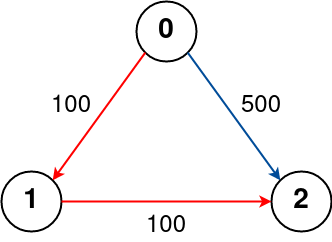

# 787 Cheapest Flights Within K Stops

There are n cities connected by some number of flights. You are given an array flights where flights[i] = [fromi, toi, pricei] indicates that there is a flight from city fromi to city toi with cost pricei.

You are also given three integers src, dst, and k, return the cheapest price from src to dst with at most k stops. If there is no such route, return -1.

[LeetCode](https://leetcode.cn/problems/cheapest-flights-within-k-stops/)

### Example 1


```
Input: n = 4, flights = [[0,1,100],[1,2,100],[2,0,100],[1,3,600],[2,3,200]], src = 0, dst = 3, k = 1
Output: 700
Explanation:
The graph is shown above.
The optimal path with at most 1 stop from city 0 to 3 is marked in red and has cost 100 + 600 = 700.
Note that the path through cities [0,1,2,3] is cheaper but is invalid because it uses 2 stops.
```

### Example 2



```
Input: n = 3, flights = [[0,1,100],[1,2,100],[0,2,500]], src = 0, dst = 2, k = 1
Output: 200
Explanation:
The graph is shown above.
The optimal path with at most 1 stop from city 0 to 2 is marked in red and has cost 100 + 100 = 200.
```
 

### Constraints

* 1 <= n <= 100
* 0 <= flights.length <= (n * (n - 1) / 2)
* flights[i].length == 3
* 0 <= from<sub>i</sub>, to<sub>i</sub> < n
* from<sub>i</sub> != to<sub>i</sub>
* 1 <= price<sub>i</sub> <= 10<sup>4</sub>
* There will not be any multiple flights between two cities.
* 0 <= src, dst, k < n
* src != dst

### C++ 

```
class Solution {
public:
    int findCheapestPrice(int n, vector<vector<int>>& flights, int src, int dst, int k) {
        /*
            Bellman Ford 動態規劃
            1. 初始化，除了出發點外，其餘點皆為INF
            2. 動態轉移，目前的狀態，到達點為前一個狀態的出發點 + cost
        */
        vector<int> prevDp(n, INT_MAX);
        prevDp[src] = 0;
        ++k; //有多少個邊

        vector<int> dp;
        int ret = INT_MAX;
        for(int i = 1; i <= k; ++i){
            dp.resize(n, INT_MAX);
            for(const vector<int>& flight : flights){
                if(prevDp[flight[0]] != INT_MAX)
                    dp[flight[1]] = min(dp[flight[1]], prevDp[flight[0]] + flight[2]);
            }

            prevDp = move(dp);
            ret = min(ret, prevDp[dst]);
        }

        return ret == INT_MAX? -1 : ret;
    }
};
```