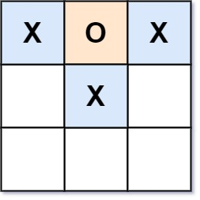

# 794 Valid Tic-Tac-Toe State

Given a Tic-Tac-Toe board as a string array board, return true if and only if it is possible to reach this board position during the course of a valid tic-tac-toe game.

The board is a 3 x 3 array that consists of characters ' ', 'X', and 'O'. The ' ' character represents an empty square.

Here are the rules of Tic-Tac-Toe:

* Players take turns placing characters into empty squares ' '.
* The first player always places 'X' characters, while the second player always places 'O' characters.
* 'X' and 'O' characters are always placed into empty squares, never filled ones.
* The game ends when there are three of the same (non-empty) character filling any row, column, or diagonal.
* The game also ends if all squares are non-empty.
* No more moves can be played if the game is over.

[LeetCode](https://leetcode.cn/problems/valid-tic-tac-toe-state/)


### Example 1


```
Input: board = ["O  ","   ","   "]
Output: false
Explanation: The first player always plays "X".
```

### Example 2



```
Input: board = ["XOX"," X ","   "]
Output: false
Explanation: Players take turns making moves.
```
 

### Constraints

* board.length == 3
* board[i].length == 3
* board[i][j] is either 'X', 'O', or ' '.

### C++ 

```
class Solution {
protected:
    bool check(const char& chr, const vector<string>& board){
        for(int i = 0; i < board.size(); ++i){
            if(board[i][0] == chr && board[i][1] == chr && board[i][2] == chr)
                return true;
            if(board[0][i] == chr && board[1][i] == chr && board[2][i] == chr)
                return true;
        }
        if(board[0][0] == chr && board[1][1] == chr && board[2][2] == chr)
            return true;
        if(board[0][2] == chr && board[1][1] == chr && board[2][0] == chr)
            return true;
        
        return false;
    }
public:
    bool validTicTacToe(vector<string>& board) {
        /*
            先下X再下O，能否達成跟board一樣的pattern
            1. 若沒有任何一方贏，X的數量會  O數量相等 || 比O多一個
            2. 若X連線了，則O必定比黑少一個
            3. 若O子連了，則O必定與X相等
            4. 不會出現兩個都連線的情形
        */
        int xCnt = 0;
        int oCnt = 0;
        for(const string& str : board){
            for(const char& chr : str){
                if(chr == 'X')
                    ++xCnt;
                else if(chr == 'O')
                    ++oCnt;
            }
        }

        if(xCnt < oCnt || xCnt - oCnt > 1)
            return false;

        //檢查有無連線
        bool xWin = check('X', board);
        bool oWin = check('O', board);

        if((xWin == true && oWin == true) || (xWin == true && xCnt - oCnt != 1) || (oWin == true && xCnt != oCnt))
            return false;

        return true;
    }
};
```