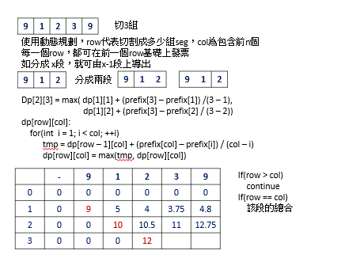

# 813 Largest Sum of Averages

You are given an integer array nums and an integer k. You can partition the array into at most k non-empty adjacent subarrays. The score of a partition is the sum of the averages of each subarray.

Note that the partition must use every integer in nums, and that the score is not necessarily an integer.

Return the maximum score you can achieve of all the possible partitions. Answers within 10-6 of the actual answer will be accepted.

[LeetCode](https://leetcode.cn/problems/largest-sum-of-averages/)


### Example 1

```
Input: nums = [9,1,2,3,9], k = 3
Output: 20.00000
Explanation: 
The best choice is to partition nums into [9], [1, 2, 3], [9]. The answer is 9 + (1 + 2 + 3) / 3 + 9 = 20.
We could have also partitioned nums into [9, 1], [2], [3, 9], for example.
That partition would lead to a score of 5 + 2 + 6 = 13, which is worse.
```

### Example 2

```
Input: nums = [1,2,3,4,5,6,7], k = 4
Output: 20.50000
```
 

### Constraints

* 1 <= nums.length <= 100
* 1 <= nums[i] <= 10<sup>4</sup>
* 1 <= k <= nums.length

### C++ 



```
class Solution {
public:
    double largestSumOfAverages(vector<int>& nums, int k) {
        int&& len = nums.size() + 1;
        vector<double> prefix(len);
        for(int i = 1; i < len; ++i)
            prefix[i] = prefix[i - 1] + nums[i - 1];

        vector<vector<double>> dp(k + 1, vector<double>(len, 0));
        for(int subs = 1; subs <= k; ++subs){
            for(int size = 1; size < len; ++size){
                if (subs == 1){
                    dp[subs][size] = prefix[size] / size;
                } else if(subs > size){
                    continue;
                } else if(subs == size){
                    dp[subs][size] = prefix[size];
                } else {
                    for(int i = 1; i < size; ++i){
                        double&& tmp = dp[subs - 1][i] + (prefix[size] - prefix[i]) / (size - i);
                        dp[subs][size] = fmax(dp[subs][size], tmp);
                    }
                }                
            }
        }

        return dp[k][nums.size()];
    }
};
```