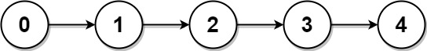

# 817 Linked List Components

You are given the head of a linked list containing unique integer values and an integer array nums that is a subset of the linked list values.

Return the number of connected components in nums where two values are connected if they appear consecutively in the linked list.

[LeetCode](https://leetcode.cn/problems/linked-list-components/)


### Example 1


```
Input: head = [0,1,2,3], nums = [0,1,3]
Output: 2
Explanation: 0 and 1 are connected, so [0, 1] and [3] are the two connected components.
```

### Example 2



```
Input: head = [0,1,2,3,4], nums = [0,3,1,4]
Output: 2
Explanation: 0 and 1 are connected, 3 and 4 are connected, so [0, 1] and [3, 4] are the two connected components.
```
 

### Constraints

* The number of nodes in the linked list is n.
* 1 <= n <= 10<sup>4</sup>
* 0 <= Node.val < n
* All the values Node.val are unique.
* 1 <= nums.length <= n
* 0 <= nums[i] < n
* All the values of nums are unique.

### C++ 

```
/**
 * Definition for singly-linked list.
 * struct ListNode {
 *     int val;
 *     ListNode *next;
 *     ListNode() : val(0), next(nullptr) {}
 *     ListNode(int x) : val(x), next(nullptr) {}
 *     ListNode(int x, ListNode *next) : val(x), next(next) {}
 * };
 */
class Solution {
public:
    int numComponents(ListNode* head, vector<int>& nums) {
        /*
            1.  鍊表每進入一個點：
                * 該點的值不在nums中
                 1. 之前的是連續的 - 將connected 置false
                 2. 之前的是不連續的 - 沒改變
                * 該點的值nums中
                 1. 之前的是不連續的，一段連續值的第一個出現 ++ret
                 2. 之前是連續的，繼續連下去
            2.  為了方便處理，建立一個 dummyHead
        */
        sort(nums.begin(), nums.end());
        bool isConnected = false;
        int ret = 0;
        
        ListNode* root = head;
        while(root != nullptr){
            vector<int>::iterator itr = lower_bound(nums.begin(), nums.end(), root->val); 
            if(itr != nums.end() && *itr == root->val){
                if(isConnected != true){
                    isConnected = true;
                    ++ret;
                } 
            } else{
                if(isConnected == true){
                    isConnected = false;
                }  

            }
            root = root -> next;
        }


        return ret;
    }
};
```