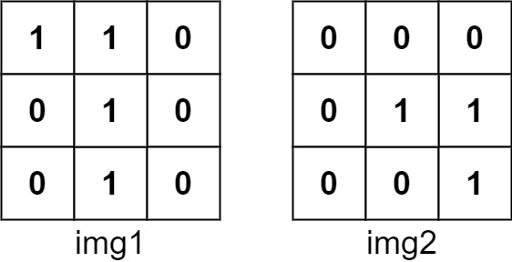

# 835 Image Overlap

You are given two images, img1 and img2, represented as binary, square matrices of size n x n. A binary matrix has only 0s and 1s as values.

We translate one image however we choose by sliding all the 1 bits left, right, up, and/or down any number of units. We then place it on top of the other image. We can then calculate the overlap by counting the number of positions that have a 1 in both images.

Note also that a translation does not include any kind of rotation. Any 1 bits that are translated outside of the matrix borders are erased.

Return the largest possible overlap.
 

[LeetCode](https://leetcode.cn/problems/image-overlap/)


### Example 1



```
Input: img1 = [[1,1,0],[0,1,0],[0,1,0]], img2 = [[0,0,0],[0,1,1],[0,0,1]]
Output: 3
Explanation: We translate img1 to right by 1 unit and down by 1 unit.
```

### Example 2

```
Input: img1 = [[1]], img2 = [[1]]
Output: 1
```
 

### Constraints

* n == img1.length == img1[i].length
* n == img2.length == img2[i].length
* 1 <= n <= 30
* img1[i][j] is either 0 or 1.
* img2[i][j] is either 0 or 1.

### C++ 

```
class Solution {
protected:
    int count(int row, int col, vector<vector<int>>& pad, vector<vector<int>>& img){
        int count = 0;
        int len = img.size();
        for(int row1 = row, row2 = 0; row2 < len; ++row1, ++row2){
            for(int col1 = col, col2 = 0; col2 < len; ++col1, ++col2){
                if(pad[row1][col1] == 1 && pad[row1][col1] == img[row2][col2])
                    ++count;
            }
        }
        return count;
    }
public:
    int largestOverlap(vector<vector<int>>& img1, vector<vector<int>>& img2) {
        /*
            在img1的外面補pad, 然後讓img2在上面滑過計算
        */
        int&& imgLen = img1.size();
        int&& padLen = imgLen + ((imgLen - 1) << 1);
        vector<vector<int>> pad(padLen, vector<int>(padLen));
        //將img1放入pad中
        int&& offset = imgLen - 1;
        for(int row1 = offset, row2 = 0; row2 < imgLen; ++row1, ++row2){
            for(int col1 = offset, col2 = 0; col2 < imgLen; ++col1, ++col2){
                pad[row1][col1] = img1[row2][col2]; 
            }
        }

        int ret = 0;
        //不同起始位置，計算overlap
        int&& limit = padLen - imgLen + 1;
        for(int row = 0; row < limit; ++row){
            for(int col = 0; col <limit; ++col){
                int&& overlap = count(row, col, pad, img2);
                ret = max(ret, overlap);
            }
        }

        return ret;
    }
};
```