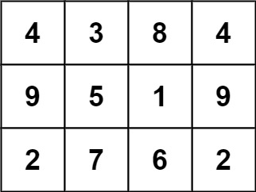

# 840 Magic Squares In Grid

A `3 x 3` magic square is a `3 x 3` grid filled with distinct numbers from 1 to 9 such that each row, column, and both diagonals all have the same sum.

Given a `row x col` grid of integers, how many `3 x 3` "magic square" subgrids are there?  (Each subgrid is contiguous).
 

[LeetCode](https://leetcode.cn/problems/magic-squares-in-grid/)


### Example 1



```
Input: grid = [[4,3,8,4],[9,5,1,9],[2,7,6,2]]
Output: 1
```

### Example 2

```
Input: grid = [[8]]
Output: 0
```
 

### Constraints

* row == grid.length
* *ol == grid[i].length
* 1 <= row, col <= 10
* 0 <= grid[i][j] <= 15

### C++ 

```
class Solution {
protected:
    bool checkSquare(vector<vector<int>>& grid, int& row, int& col) {
        int magicNum = 0;
        int visted = (1 << 10) - 2;
        for (int i = 0; i < 3; ++i) {
            visted ^= 1 << grid[row + i][col];
            visted ^= 1 << grid[row + i][col + 1];
            visted ^= 1 << grid[row + i][col + 2];

            int&& rowSum = grid[row + i][col] + grid[row + i][col + 1] + grid[row + i][col + 2];
            int&& colSum = grid[row][col + i] + grid[row + 1][col + i] + grid[row + 2][col + i];
            if (rowSum != colSum)
                return false;

            if (magicNum == 0)
                magicNum = move(rowSum);
            else if (magicNum != rowSum)
                return false;
        }

        if(visted != 0)
            return false;
        // 對角線
        if (grid[row][col] + grid[row + 1][col + 1] + grid[row + 2][col + 2] != magicNum)
            return false;
        if (grid[row + 2][col] + grid[row + 1][col + 1] + grid[row][col + 2] != magicNum)
            return false;
        
        return true;
    }

public:
    int numMagicSquaresInside(vector<vector<int>>& grid) {
        /*
            整個大矩陣每 3x3的去掃瞄
        */
        int&& rowNum = grid.size();
        int&& colNum = grid[0].size();

        int ret = 0;
        for (int row = 0; row < rowNum; ++row) {
            if (row + 2 >= rowNum)
                break;
            for (int col = 0; col < colNum; ++col) {
                // 確認以row, col為左上角的3x3是否然在大矩陣內
                if (col + 2 >= colNum)
                    break;

                if (checkSquare(grid, row, col) == true)
                    ++ret;
            }
        }

        return ret;
    }
};
```