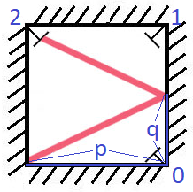

# 858 Mirror Reflection

There is a special square room with mirrors on each of the four walls. Except for the southwest corner, there are receptors on each of the remaining corners, numbered 0, 1, and 2.

The square room has walls of length p and a laser ray from the southwest corner first meets the east wall at a distance q from the 0th receptor.

Given the two integers p and q, return the number of the receptor that the ray meets first.

The test cases are guaranteed so that the ray will meet a receptor eventually.
 

[LeetCode](https://leetcode.cn/problems/mirror-reflection/)


### Example 1




```
Input: p = 2, q = 1
Output: 2
Explanation: The ray meets receptor 2 the first time it gets reflected back to the left wall.
```

### Example 2

```
Input: p = 3, q = 1
Output: 1
```

### Constraints

* 1 <= q <= p <= 1000

### C++ 

```
class Solution {
protected:
    int gcd(int a, int b) {
        if (a % b == 0)
            return b;

        return gcd(b, a % b);
    }

public:
    int mirrorReflection(int p, int q) {
        /*
            laser每次前進的距離是q的倍數
            總前進距離 / q為奇數的話，就是在右邊
                            偶數，就是在左邊

            if 總距離 % p == 0 :
                在右邊
                總距離 / p 奇數: 1
                          偶數: 0
                在左邊
                總距離 / P 奇數：2

        */
        int&& gcdNum = gcd(p, q);
        int minDist = (p / gcdNum) * (q / gcdNum) * gcdNum;
        int dist = minDist;

        while (!(dist / q & 1) && !(dist / p & 1))
            dist += minDist;

        if ((dist / q) & 1) { // 在右邊
            if (dist / p & 1)
                return 1;
            else
                return 0;
        } else {
            return 2;
        }
    }
};
```