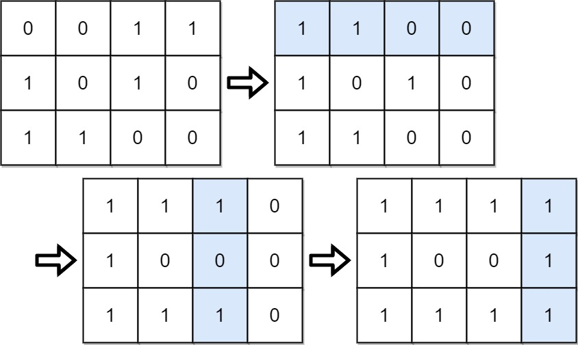

# 861 Score After Flipping Matrix

You are given an m x n binary matrix grid.

A move consists of choosing any row or column and toggling each value in that row or column (i.e., changing all 0's to 1's, and all 1's to 0's).

Every row of the matrix is interpreted as a binary number, and the score of the matrix is the sum of these numbers.

Return the highest possible score after making any number of moves (including zero moves).
 

[LeetCode](https://leetcode.cn/problems/score-after-flipping-matrix/)


### Example 1




```
Input: grid = [[0,0,1,1],[1,0,1,0],[1,1,0,0]]
Output: 39
Explanation: 0b1111 + 0b1001 + 0b1111 = 15 + 9 + 15 = 39
```

### Example 2

```
Input: grid = [[0]]
Output: 1
```

### Constraints

* m == grid.length
* n == grid[i].length
* 1 <= m, n <= 20
* grid[i][j] is either 0 or 1.

### C++ 

```
class Solution {
public:
    int matrixScore(vector<vector<int>>& grid) {
        /*
            為了讓數值最大化
            1. 要先讓第0位的值為0
            2. 再一列一列的看，比較1及0的數量，如果0比較多則翻轉
        */
        int rowNum = grid.size();
        int colNum = grid[0].size();


        // 先確認每一row要不要翻轉
        for(int row = 0; row < rowNum; ++row){
            if(grid[row][0] == 1)
                continue;
            for(int col = 0; col < colNum; ++col)
                grid[row][col] ^= 1;    
        }

        //再確認col上的1的量
        for(int col = 1; col < colNum; ++col){
            int count = 0;
            for(int row = 0; row < rowNum; ++row){
                if(grid[row][col] == 1)
                    ++count;
            }   
            if(count > rowNum - count)
                continue;
            for(int row = 0; row < rowNum; ++row){
                grid[row][col] ^= 1;
            }
        }

        int ret = 0;
        for(const vector<int>& row : grid){
            int tmp = 0;
            for(const int& bit : row){
                tmp <<= 1;
                tmp += bit; 
            }
            ret += tmp;
        }
            
        return  ret;
    }
};
```