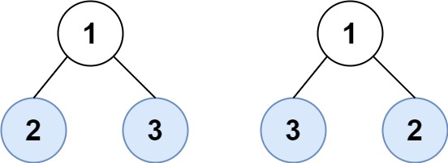

# 872 葉子相似的樹

請考慮一棵二叉樹上所有的葉子，這些葉子的值按從左到右的順序排列形成一個 葉值序列 。


舉個例子，如上圖所示，給定一棵葉值序列為 (6, 7, 4, 9, 8) 的樹。

如果有兩棵二叉樹的葉值序列是相同，那麽我們就認為它們是 葉相似 的。

如果給定的兩個根結點分別為 root1 和 root2 的樹是葉相似的，則返回 true；否則返回 false 。

##  Leaf-Similar Trees

Consider all the leaves of a binary tree, from left to right order, the values of those leaves form a leaf value sequence.


For example, in the given tree above, the leaf value sequence is (6, 7, 4, 9, 8).

Two binary trees are considered leaf-similar if their leaf value sequence is the same.

Return true if and only if the two given trees with head nodes root1 and root2 are leaf-similar.

[LeetCode](https://leetcode.cn/problems/leaf-similar-trees/)

### Example 1


> Input: root1 = [3,5,1,6,2,9,8,null,null,7,4], root2 = [3,5,1,6,7,4,2,null,null,null,null,null,null,9,8]  
Output: true  

### Example 2



> Input: root1 = [1,2,3], root2 = [1,3,2]
Output: false 

### Constraints

* The number of nodes in each tree will be in the range [1, 200].
* Both of the given trees will have values in the range [0, 200].

### C++ 

```
/**
 * Definition for a binary tree node.
 * struct TreeNode {
 *     int val;
 *     TreeNode *left;
 *     TreeNode *right;
 *     TreeNode() : val(0), left(nullptr), right(nullptr) {}
 *     TreeNode(int x) : val(x), left(nullptr), right(nullptr) {}
 *     TreeNode(int x, TreeNode *left, TreeNode *right) : val(x), left(left), right(right) {}
 * };
 */
class Solution {
protected:
   void getLeafNode(TreeNode*& root, vector<int>& leafs){
        if(root->left == nullptr && root->right == nullptr){
            leafs.push_back(root->val);
            return;
        }

        if(root->left != nullptr)
            getLeafNode(root->left, leafs);
        if(root->right != nullptr)
            getLeafNode(root->right, leafs);      
    }
public:
    bool leafSimilar(TreeNode* root1, TreeNode* root2) {
        /*
            找出葉子節點，將其儲存起來
            比較兩個葉子節點的紀錄
        */
        vector<int> leaf1; 
        getLeafNode(root1, leaf1);
        vector<int> leaf2;
        getLeafNode(root2, leaf2);

        return leaf1 == leaf2;
    }
};
```