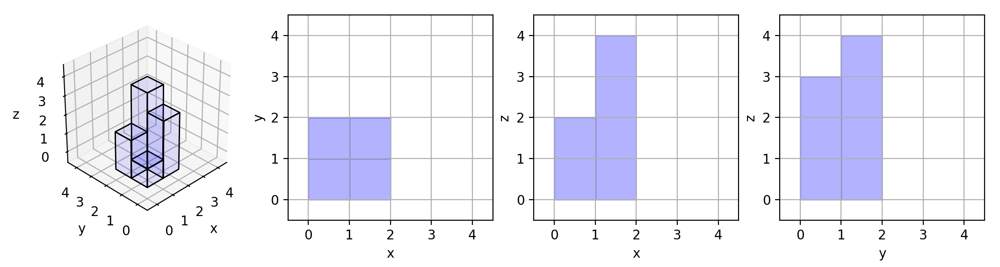

# 883 三維體投影面積

在 n x n 的網格 grid 中，我們放置了一些與 x，y，z 三軸對齊的 1 x 1 x 1 立方體。

每個值 v = grid[i][j] 表示 v 個正方體疊放在單元格 (i, j) 上。

現在，我們查看這些立方體在 xy 、yz 和 zx 平面上的投影。

投影 就像影子，將 三維 形體映射到一個 二維 平面上。從頂部、前面和側面看立方體時，我們會看到“影子”。

返回 所有三個投影的總面積 。

##  Projection Area of 3D Shapes

You are given an n x n grid where we place some 1 x 1 x 1 cubes that are axis-aligned with the x, y, and z axes.

Each value v = grid[i][j] represents a tower of v cubes placed on top of the cell (i, j).

We view the projection of these cubes onto the xy, yz, and zx planes.

A projection is like a shadow, that maps our 3-dimensional figure to a 2-dimensional plane. We are viewing the "shadow" when looking at the cubes from the top, the front, and the side.

Return the total area of all three projections.

[LeetCode](https://leetcode.cn/problems/projection-area-of-3d-shapes/)

### Example 1



> Input: grid = [[1,2],[3,4]]  
Output: 17  
Explanation: Here are the three projections ("shadows") of the shape made with each axis-aligned plane.  

### Example 2

> Input: grid = [[2]]  
Output: 5

### Constraints

* n == grid.length == grid[i].length
* 1 <= n <= 50
* 0 <= grid[i][j] <= 50

### C++ 

```
class Solution {
public:
    int projectionArea(vector<vector<int>>& grid) {
        int&& len = grid.size();
        int ret = 0;

        //  xz平面
        for(int row = 0; row < len; ++row){
            ret += (*max_element(grid[row].begin(), grid[row].end()));
        }

        for(int col = 0; col < len; ++col){
            int tmpMax = 0;
            for(int row = 0; row < len; ++row){
                ret += grid[row][col] == 0? 0 : 1;
                tmpMax = max(tmpMax, grid[row][col]);
            }
            ret += tmpMax;
        }

        return ret;
    }
};
```