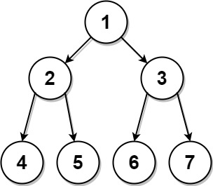

# 889 Construct Binary Tree from Preorder and Postorder Traversal

Given two integer arrays, `preorder` and `postorder` where `preorder` is the `preorder` traversal of a binary tree of distinct values and postorder is the postorder traversal of the same tree, reconstruct and return the binary tree.

If there exist multiple answers, you can return any of them.

[LeetCode](https://leetcode.cn/problems/construct-binary-tree-from-preorder-and-postorder-traversal/)


### Example 1



```
Input: preorder = [1,2,4,5,3,6,7], postorder = [4,5,2,6,7,3,1]
Output: [1,2,3,4,5,6,7]
```

### Example 2

```
Input: preorder = [1], postorder = [1]
Output: [1]
```

### Constraints

* 1 <= preorder.length <= 30
* 1 <= preorder[i] <= preorder.length
* All the values of preorder are unique.
* postorder.length == preorder.length
* 1 <= postorder[i] <= postorder.length
* All the values of postorder are unique.
* It is guaranteed that preorder and postorder are the preorder traversal and postorder traversal of the same binary tree.


### C++ 

```
/**
 * Definition for a binary tree node.
 * struct TreeNode {
 *     int val;
 *     TreeNode *left;
 *     TreeNode *right;
 *     TreeNode() : val(0), left(nullptr), right(nullptr) {}
 *     TreeNode(int x) : val(x), left(nullptr), right(nullptr) {}
 *     TreeNode(int x, TreeNode *left, TreeNode *right) : val(x), left(left), right(right) {}
 * };
 */
class Solution {
protected:
    unordered_map<int, int> postMap;
    TreeNode* recursion(const vector<int>& preorder, int preStart, int preEnd, int postStart, int postEnd){
        if(preStart > preEnd)
            return nullptr;
        else if(preStart == preEnd)
            return new TreeNode(preorder[preStart]);

        //當前這一段的根
        TreeNode* root = new TreeNode(preorder[preStart]);
        //分割出左右子樹的區域
       
        //左子樹長度   
        int&& leftlen = postMap[preorder[preStart + 1]] - postStart + 1;    
        root->left = recursion(preorder, preStart + 1, preStart + leftlen, postStart, postStart + leftlen - 1);
        root->right = recursion(preorder, preStart + leftlen + 1, preEnd, postStart + leftlen, postEnd - 1);

        return root;
    }
public:
    TreeNode* constructFromPrePost(vector<int>& preorder, vector<int>& postorder) {
        /*
            recursion
            1. 先找出目前的根節點，也甘是pre的第一個post的最後一個
            2. 找出後，更新範圍，recursion左分支及右分支範圍，並接起左右分支
            3. 回傳當前的根節點
        */
        int&& end = preorder.size() - 1;
        for(int i = 0; i < preorder.size(); ++i)
            postMap[postorder[i]] = i;       

        return recursion(preorder, 0, end, 0, end);
    }
};
```