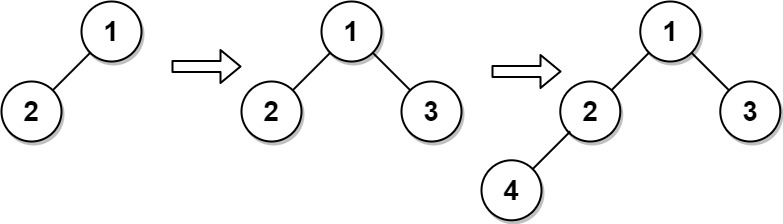

# 919 Maximum Sum Circular Subarray

A complete binary tree is a binary tree in which every level, except possibly the last, is completely filled, and all nodes are as far left as possible.

Design an algorithm to insert a new node to a complete binary tree keeping it complete after the insertion.

Implement the CBTInserter class:

* `CBTInserter(TreeNode root)` Initializes the data structure with the `root` of the complete binary tree.
* `int insert(int v)` Inserts a `TreeNode` into the tree with value `Node.val == val` so that the tree remains complete, and returns the value of the parent of the inserted `TreeNode`.
* `TreeNode get_root()` Returns the root node of the tree.
 
 

[LeetCode](https://leetcode.cn/problems/complete-binary-tree-inserter/)


### Example 1



```
Input
["CBTInserter", "insert", "insert", "get_root"]
[[[1, 2]], [3], [4], []]
Output
[null, 1, 2, [1, 2, 3, 4]]

Explanation
CBTInserter cBTInserter = new CBTInserter([1, 2]);
cBTInserter.insert(3);  // return 1
cBTInserter.insert(4);  // return 2
cBTInserter.get_root(); // return [1, 2, 3, 4]
```


### Constraints

* The number of nodes in the tree will be in the range [1, 1000].
* 0 <= Node.val <= 5000
* root is a complete binary tree.
* 0 <= val <= 5000
* At most 10<sup>4</sup> calls will be made to insert and get_root.

### C++ 

```
/**
 * Definition for a binary tree node.
 * struct TreeNode {
 *     int val;
 *     TreeNode *left;
 *     TreeNode *right;
 *     TreeNode() : val(0), left(nullptr), right(nullptr) {}
 *     TreeNode(int x) : val(x), left(nullptr), right(nullptr) {}
 *     TreeNode(int x, TreeNode *left, TreeNode *right) : val(x), left(left), right(right) {}
 * };
 */
class CBTInserter {
protected:
    vector<TreeNode*> flatTree;
public:
    CBTInserter(TreeNode* root) {
        //完全二叉樹，為了方便維護，使用vector會更容易
        flatTree.push_back(root);
        for(int i = 0; i < flatTree.size(); ++i){
            if(flatTree[i]->left != nullptr)
                flatTree.push_back(flatTree[i]->left);
            else
                break;

            if(flatTree[i]->right != nullptr)
                flatTree.push_back(flatTree[i]->right);
            else 
                break;
        }

    }
    
    int insert(int val) {
        int id = flatTree.size();
        flatTree.emplace_back(new TreeNode(val));
        int&& parentId = (id - 1) >> 1;
        if(id & 1)
            flatTree[parentId]->left = flatTree[id];
        else
            flatTree[parentId]->right = flatTree[id];

        return flatTree[parentId]->val;
    }
    
    TreeNode* get_root() {
        return flatTree.front();
    }
};

/**
 * Your CBTInserter object will be instantiated and called as such:
 * CBTInserter* obj = new CBTInserter(root);
 * int param_1 = obj->insert(val);
 * TreeNode* param_2 = obj->get_root();
 */
```