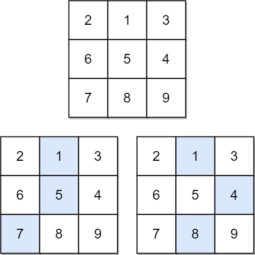

# 931 Minimum Falling Path Sum

Given an n x n array of integers matrix, return the minimum sum of any falling path through matrix.

A falling path starts at any element in the first row and chooses the element in the next row that is either directly below or diagonally left/right. Specifically, the next element from position (row, col) will be (row + 1, col - 1), (row + 1, col), or (row + 1, col + 1).

[LeetCode](https://leetcode.cn/problems/minimum-falling-path-sum/)


### Example 1



```
Input: matrix = [[2,1,3],[6,5,4],[7,8,9]]
Output: 13
Explanation: There are two falling paths with a minimum sum as shown.
```

### Example 2


```
Input: matrix = [[-19,57],[-40,-5]]
Output: -59
Explanation: The falling path with a minimum sum is shown.
```

### Constraints

* n == matrix.length == matrix[i].length
* 1 <= n <= 100
* -100 <= matrix[i][j] <= 100

### C++ 

```
class Solution {
public:
    int minFallingPathSum(vector<vector<int>>& matrix) {
        /*
            目前的位置的最小值，必然是繼續前方的最小值而來
        */  
        int&& len = matrix.size();
        for(int row = 1; row < len; ++row){
            for(int col = 0; col < len; ++col){
                if(col == 0){
                    matrix[row][col] += min(matrix[row - 1][col], matrix[row - 1][col + 1]);
                } else if(col == len - 1){
                    matrix[row][col] += min(matrix[row - 1][col], matrix[row - 1][col - 1]);
                } else{
                    matrix[row][col] += min({matrix[row - 1][col - 1], matrix[row - 1][col], matrix[row - 1][col + 1]});
                }
            }
        }

        return *min_element(matrix.back().begin(), matrix.back().end());
    }
};
```