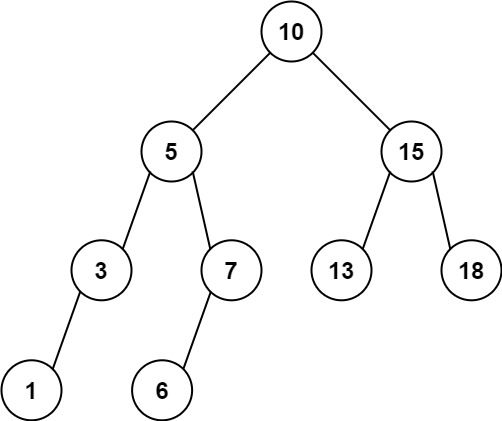

# 938  二叉搜索樹的範圍和

給定二叉搜索樹的根結點 root，返回值位於範圍 [low, high] 之間的所有結點的值的和。

##  Increasing Order Search Tree

Given the root of a binary search tree, rearrange the tree in in-order so that the leftmost node in the tree is now the root of the tree, and every node has no left child and only one right child.

[LeetCode](https://leetcode.cn/problems/range-sum-of-bst/)

### Example 1


> Input: root = [10,5,15,3,7,null,18], low = 7, high = 15  
Output: 32  
Explanation: Nodes 7, 10, and 15 are in the range [7, 15]. 7 + 10 + 15 = 32.  

### Example 2



> Input: root = [10,5,15,3,7,13,18,1,null,6], low = 6, high = 10  
Output: 23  
Explanation: Nodes 6, 7, and 10 are in the range [6, 10]. 6 + 7 + 10 = 23.  

### Constraints

* The number of nodes in the tree is in the range [1, 2 * 10<sup>4</sup>].  
* 1 <= Node.val <= 10<sup>5</sup>  
* 1 <= low <= high <= 10<sup>5</sup>  
* All Node.val are unique.  
 


### C++ 

```
/**
 * Definition for a binary tree node.
 * struct TreeNode {
 *     int val;
 *     TreeNode *left;
 *     TreeNode *right;
 *     TreeNode() : val(0), left(nullptr), right(nullptr) {}
 *     TreeNode(int x) : val(x), left(nullptr), right(nullptr) {}
 *     TreeNode(int x, TreeNode *left, TreeNode *right) : val(x), left(left), right(right) {}
 * };
 */
class Solution {
protected:
    void inOrder(TreeNode* root, int& sum, const int& low, const int& high){
        if(root == nullptr)
            return;
        
        if(root->val > low)
            inOrder(root->left, sum, low, high);
        if(root->val >= low && root->val <= high)
            sum += root->val;
        if(root->val < high)
            inOrder(root->right, sum, low, high);
    }
public:
    int rangeSumBST(TreeNode* root, int low, int high) {
        /*
            使用inorder，對只在low及high範圍內的值相加
            為了增加速度，當該點的值小於low或是大於high後，可適定改變走到的下一點
        */

        int sum = 0;
        inOrder(root, sum, low, high);

        return sum;
    }
};
```