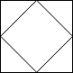

# 959 Regions Cut By Slashes

An n x n grid is composed of 1 x 1 squares where each 1 x 1 square consists of a '/', '\', or blank space ' '. These characters divide the square into contiguous regions.

Given the grid grid represented as a string array, return the number of regions.

Note that backslash characters are escaped, so a '\' is represented as '\\'.
 

[LeetCode](https://leetcode.cn/problems/regions-cut-by-slashes/)


### Example 1


```
Input: grid = [" /","/ "]
Output: 2
```

### Example 2



```
Input: grid = ["/\\","\\/"]
Output: 5
Explanation: Recall that because \ characters are escaped, "\\/" refers to \/, and "/\\" refers to /\.
```

### Constraints

* n == grid.length == grid[i].length
* 1 <= n <= 30
* grid[i][j] is either '/', '\', or ' '.

### C++ 

```
class Solution {
public:
    int regionsBySlashes(vector<string>& grid) {
        /*
            將圖形轉換成找島嶼數量即可
            將每一個方格轉化成3 x 3
        */
        int&& gridLen = grid.size();
        int&& len = gridLen * 3;
        vector<vector<int>> island(len, vector<int>(len));
        //轉換成3x3圖形
        for(int row = 0; row < gridLen; ++row){
            for(int col = 0; col < gridLen; ++col){
                if(grid[row][col] == '/'){
                    island[row * 3][col * 3 + 2] = 1;
                    island[row * 3 + 1][col * 3 + 1] = 1;
                    island[row * 3 + 2][col * 3] = 1;
                } else if(grid[row][col] == '\\'){
                    island[row * 3][col * 3] = 1;
                    island[row * 3 + 1][col * 3 + 1] = 1;
                    island[row * 3 + 2][col * 3 + 2] = 1;
                }
            }
        }

        int moves[4][2] = {{-1,0},{1,0},{0,-1},{0,1}};
        typedef pair<int, int> iPair;
        queue<iPair> que;
        int ret = 0;

        for(int row = 0; row < len; ++row){
            for(int col = 0; col < len; ++col){
                if(island[row][col] == 0){
                    ++ret;
                    que.emplace(row, col);
                    island[row][col] = 1;
                    while(que.empty() != true){
                        iPair curr = move(que.front());
                        que.pop();
                        for(int i = 0; i < 4; ++i){
                            int&& nextRow = curr.first + moves[i][0];
                            int&& nextCol = curr.second + moves[i][1];
                            if(nextRow >= 0 && nextRow < len && nextCol >= 0 && nextCol < len && island[nextRow][nextCol] == 0){
                                que.emplace(nextRow, nextCol);
                                island[nextRow][nextCol] = 1;
                            }
                        }
                    }
                }
            }
        }
        return  ret;
    }
};
```