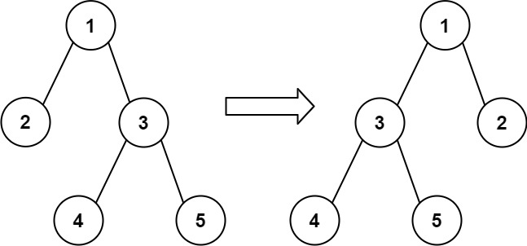

# 971 Flip Binary Tree To Match Preorder Traversal

You are given the root of a binary tree with n nodes, where each node is uniquely assigned a value from 1 to n. You are also given a sequence of n values voyage, which is the desired pre-order traversal of the binary tree.

Any node in the binary tree can be flipped by swapping its left and right subtrees. For example, flipping node 1 will have the following effect:
 
 

 Flip the smallest number of nodes so that the pre-order traversal of the tree matches voyage.

Return a list of the values of all flipped nodes. You may return the answer in any order. If it is impossible to flip the nodes in the tree to make the pre-order traversal match voyage, return the list [-1].

[LeetCode](https://leetcode.cn/problems/flip-binary-tree-to-match-preorder-traversal/)


### Example 1

```
Input: root = [1,2], voyage = [2,1]
Output: [-1]
Explanation: It is impossible to flip the nodes such that the pre-order traversal matches voyage.
```

### Example 2

```
Input: root = [1,2,3], voyage = [1,3,2]
Output: [1]
Explanation: Flipping node 1 swaps nodes 2 and 3, so the pre-order traversal matches voyage.
```

### Constraints

* The number of nodes in the tree is n.
* n == voyage.length
* 1 <= n <= 100
* 1 <= Node.val, voyage[i] <= n
* All the values in the tree are unique.
* All the values in voyage are unique.

### C++ 

```
class Solution {
protected:
    int index{0};
    vector<int> flipPoints;
    bool dfs(TreeNode* root, vector<int>& nums){
        if(root == nullptr)
            return true;
        
        if(root->val != nums[index++])
            return false;
        
        //如果兩個樹一致的話，左子樹的值與nums[index]對應的值不一樣的話，該節點需翻轉
        if(root->left != nullptr && root->left->val != nums[index]){
            flipPoints.push_back(root->val);
            return dfs(root->right, nums) && dfs(root->left, nums);
        } else {
            return dfs(root->left, nums) && dfs(root->right, nums);
        }
    }
public:
    vector<int> flipMatchVoyage(TreeNode* root, vector<int>& voyage) {
        /*
            以前序遍曆二叉樹，並另以一個index記錄若兩個相等，應該要在
            左子樹上的第一個與voyage看到的值相同
            若不是的話，就記下來該點應該要交換
            繼續下去若index對應的值與該點的值不同，回傳false
        */
        if(dfs(root, voyage) == true)
            return flipPoints;
        return {-1};
    }
};
```