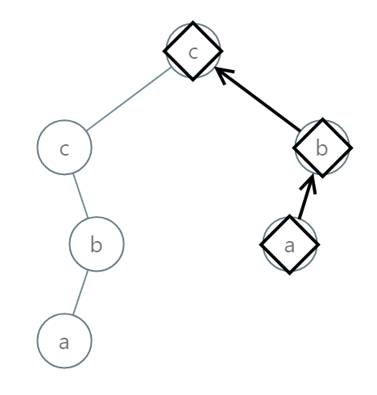

# 988   Smallest String Starting From Leaf

You are given an integer array nums and an array queries where queries[i] = [vali, indexi].

You are given the root of a binary tree where each node has a value in the range [0, 25] representing the letters 'a' to 'z'.

Return the lexicographically smallest string that starts at a leaf of this tree and ends at the root.

As a reminder, any shorter prefix of a string is lexicographically smaller.

* For example, "ab" is lexicographically smaller than "aba".

A leaf of a node is a node that has no children.

[LeetCode](https://leetcode.cn/problems/smallest-string-starting-from-leaf/)


### Example 1


```
Input: root = [0,1,2,3,4,3,4]
Output: "dba"
```

### Example 2



```
Input: root = [2,2,1,null,1,0,null,0]
Output: "abc"
```

### Constraints

* The number of nodes in the tree is in the range [1, 8500].
* 0 <= Node.val <= 25

### C++ 

```
/**
 * Definition for a binary tree node.
 * struct TreeNode {
 *     int val;
 *     TreeNode *left;
 *     TreeNode *right;
 *     TreeNode() : val(0), left(nullptr), right(nullptr) {}
 *     TreeNode(int x) : val(x), left(nullptr), right(nullptr) {}
 *     TreeNode(int x, TreeNode *left, TreeNode *right) : val(x), left(left), right(right) {}
 * };
 */
class Solution {
protected:
    void dfs(TreeNode* root, string& path, string& minStr){
        char curr = root->val + 'a';
        path = curr + path;
        if(root->left == nullptr && root->right == nullptr){
            minStr = min(path, minStr);
            path = path.substr(1);
            return;
        }        

        if(root->left)
            dfs(root->left, path, minStr);
        if(root->right)
            dfs(root->right, path, minStr);
        path = path.substr(1);
    }
public:
    string smallestFromLeaf(TreeNode* root) {
        string minStr(1, 26 + 'a');
        string path;
        dfs(root, path, minStr);

        return minStr;
    }
};
```