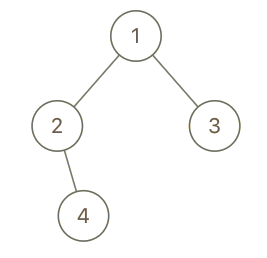

# 993  二叉樹的堂兄弟節點

在二叉樹中，根節點位於深度 0 處，每個深度為 k 的節點的子節點位於深度 k+1 處。

如果二叉樹的兩個節點深度相同，但 父節點不同 ，則它們是一對堂兄弟節點。

我們給出了具有唯一值的二叉樹的根節點 root ，以及樹中兩個不同節點的值 x 和 y 。

只有與值 x 和 y 對應的節點是堂兄弟節點時，才返回 true 。否則，返回 false。

##  Cousins in Binary Tree

Given the root of a binary tree with unique values and the values of two different nodes of the tree x and y, return true if the nodes corresponding to the values x and y in the tree are cousins, or false otherwise.

Two nodes of a binary tree are cousins if they have the same depth with different parents.

Note that in a binary tree, the root node is at the depth 0, and children of each depth k node are at the depth k + 1.

[LeetCode](https://leetcode.cn/problems/cousins-in-binary-tree/)

### Example 1


> Input: root = [1,2,3,4], x = 4, y = 3  
Output: false  

### Example 2



> Input: root = [1,2,3,null,4], x = 2, y = 3  
Output: false  
   

### Constraints

* The number of nodes in the tree is in the range [2, 100].
* 1 <= Node.val <= 100
* Each node has a unique value.
* x != y
* x and y are exist in the tree.
 
### C++ 

```
/**
 * Definition for a binary tree node.
 * struct TreeNode {
 *     int val;
 *     TreeNode *left;
 *     TreeNode *right;
 *     TreeNode() : val(0), left(nullptr), right(nullptr) {}
 *     TreeNode(int x) : val(x), left(nullptr), right(nullptr) {}
 *     TreeNode(int x, TreeNode *left, TreeNode *right) : val(x), left(left), right(right) {}
 * };
 */
class Solution {
public:
    typedef pair<TreeNode*, TreeNode*> iPair;
    bool isCousins(TreeNode* root, int x, int y) {
        /*
            檢查包含x y數值的兩個node，其深度是否相同
            使用BFS一層一層檢查，當其中一個為true時，也一定要有另一個，不然反回false
        */
        queue<iPair> que;
        que.emplace(root, nullptr);

        while(que.empty() != true){
            int&& len = que.size();
            int matchCnt = 0;
            TreeNode* parent1 = nullptr;
            TreeNode* parent2 = nullptr;

            while(len--){
                iPair curr = que.front();
                que.pop();
                if(curr.first->val == x || curr.first->val == y){
                    ++matchCnt;
                    if(parent1 == nullptr)
                        parent1 = curr.second;
                    else
                        parent2 = curr.second;
                }

                if(curr.first->left != nullptr)
                    que.emplace(curr.first->left, curr.first);
                
                if(curr.first->right != nullptr)
                    que.emplace(curr.first->right, curr.first);
            }

            if(matchCnt == 2 && parent1 != parent2)
                return true;
            else if(matchCnt > 0)
                return false;
        }

        return false;
    }
};
```