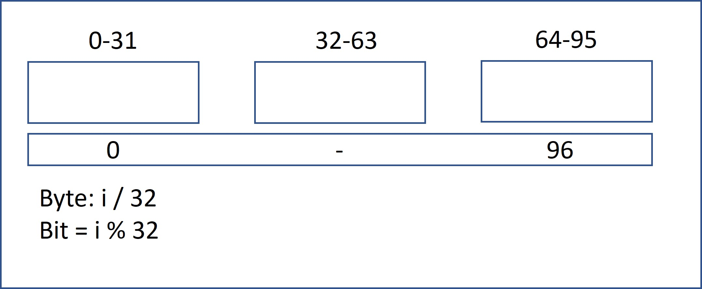

# 面試金典 0508 繪制直線

有個單色屏幕存儲在一個一維數組中，使得32個連續像素可以存放在一個 int 里。屏幕寬度為w，且w可被32整除（即一個 int 不會分布在兩行上），屏幕高度可由數組長度及屏幕寬度推算得出。請實現一個函數，繪制從點(x1, y)到點(x2, y)的水平線。

給出數組的長度 length，寬度 w（以比特為單位）、直線開始位置 x1（比特為單位）、直線結束位置 x2（比特為單位）、直線所在行數 y。返回繪制過後的數組。

##  Draw Line

A monochrome screen is stored as a single array of int, allowing 32 consecutive pixels to be stored in one int. The screen has width w, where w is divisible by 32 (that is, no byte will be split across rows). The height of the screen, of course, can be derived from the length of the array and the width. Implement a function that draws a horizontal line from (x1, y) to (x2, y).

Given the length of the array, the width of the array (in bit), start position x1 (in bit) of the line, end position x2 (in bit) of the line and the row number y of the line, return the array after drawing.

[LeetCode](https://leetcode-cn.com/problems/draw-line-lcci)


### Example 1
```
輸入：length = 1, w = 32, x1 = 30, x2 = 31, y = 0
輸出：[3]
說明：在第0行的第30位到第31為畫一條直線，屏幕表示為[0b000000000000000000000000000000011]

```

### Example 2
```
輸入：length = 3, w = 96, x1 = 0, x2 = 95, y = 0
輸出：[-1, -1, -1]
```

### C++ 

* 時間複雜度 O(n) n為 x1 -x2間的元素數量

* 空間複雜度 O(1)



```
/* Definition for singly-linked list. */
class Solution
{
public:
    vector<int> drawLine(int length, int w, int x1, int x2, int y)
    {
        vector<int> ret(length, 0);
        /* each line is combine by w / 32 integers*/
        const int numRow = w / 32;

        /* process the row in which a line will be drawn*/
        int byteId = 0;
        int bitId = 0;
        for (int i = x1; i <= x2; ++i)
        {
            byteId = i / 32 + y * numRow;
            bitId = i % 32;
            ret[byteId] = ret[byteId] | (1 << (31 - bitId) );
        }

        return ret;
    }
};

int main()
{
    Solution test;
    vector<int> res = test.drawLine(3, 96, 0, 95, 0);

    return 0;
}
```
