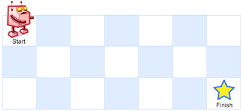

# 面試金典 0802 迷路的機器人

設想有個機器人坐在一個網格的左上角，網格 r 行 c 列。機器人只能向下或向右移動，但不能走到一些被禁止的網格（有障礙物）。設計一種算法，尋找機器人從左上角移動到右下角的路徑。

網格中的障礙物和空位置分別用 1 和 0 來表示。



返回一條可行的路徑，路徑由經過的網格的行號和列號組成。左上角為 0 行 0 列。如果沒有可行的路徑，返回空數組。


## Robot in a Grid

Imagine a robot sitting on the upper left corner of grid with r rows and c columns. The robot can only move in two directions, right and down, but certain cells are "off limits" such that the robot cannot step on them. Design an algorithm to find a path for the robot from the top left to the bottom right.

"off limits" and empty grid are represented by 1 and 0 respectively.

Return a valid path, consisting of row number and column number of grids in the path.

 
[LeetCode](https://leetcode-cn.com/problems/robot-in-a-grid-lcci/)

### Example 1
```
Input:
[
  [0,0,0],
  [0,1,0],
  [0,0,0]
]
Output: [[0,0],[0,1],[0,2],[1,2],[2,2]]

```

### C++ 


```
#include <vector>
#include <queue>
#include <algorithm>

using namespace std;

class Solution
{
private:
    const vector<vector<int>> movement = {{1, 0}, {0, 1}}; // down, right
public:
    vector<vector<int>> pathWithObstacles(vector<vector<int>> &obstacleGrid)
    {
        int rowNum = obstacleGrid.size();
        int colNum = obstacleGrid[0].size();

        /* BFS algorithm */
        vector<vector<pair<int, int>>> source(rowNum, vector<pair<int, int>>(colNum, make_pair(-1, -1)));
        queue<pair<int, int>> frontier;

        /* set start point*/
        if(obstacleGrid[0][0] == false)
            frontier.push(make_pair(0, 0));
        int nextRow = 0;
        int nextCol = 0;
        bool found = false;
        while (frontier.empty() != true)
        {
            pair<int, int> temp = frontier.front();
            frontier.pop();

            if (temp.first == rowNum - 1 && temp.second == colNum - 1 )
            {
                found = true;
                break;
            }
            for (int i = 0; i < 2; i++)
            {
                nextRow = temp.first + movement[i][0];
                nextCol = temp.second + movement[i][1];
                if (nextRow >= 0 && nextRow < rowNum && nextCol >= 0 && nextCol < colNum && obstacleGrid[nextRow][nextCol] != 1)
                {
                    frontier.push(make_pair(nextRow, nextCol));
                    obstacleGrid[nextRow][nextCol] = 1;
                    source[nextRow][nextCol] = temp;
                }
            }
        }

        if (found == false)
            return {};

        vector<vector<int>> trace;
        pair<int, int> node = make_pair(rowNum - 1, colNum - 1);
        while (node.first != 0 || node.second != 0)
        {
            trace.push_back({node.first, node.second});
            node = source[node.first][node.second];
        }
        trace.push_back({0, 0});

        reverse(trace.begin(), trace.end());

        return trace;
    }
};

int main(void)
{
    /* input*/
    vector<vector<int>> input = {
         {0, 0, 0},
         {0, 1, 0},
         {0, 0, 0}};

    Solution test;
    vector<vector<int>> res = test.pathWithObstacles(input);

    return 0;
}
```
