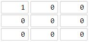

# 1126 As Far from Land as Possible

Given an n x n grid containing only values 0 and 1, where 0 represents water and 1 represents land, find a water cell such that its distance to the nearest land cell is maximized, and return the distance. If no land or water exists in the grid, return -1.

The distance used in this problem is the Manhattan distance: the distance between two cells (x0, y0) and (x1, y1) is |x0 - x1| + |y0 - y1|.
 
[LeetCode](https://leetcode.cn/problems/as-far-from-land-as-possible/)

### Example 1


```
Input: grid = [[1,0,1],[0,0,0],[1,0,1]]
Output: 2
Explanation: The cell (1, 1) is as far as possible from all the land with distance 2.
```

### Example 2



```
Input: grid = [[1,0,0],[0,0,0],[0,0,0]]
Output: 4
Explanation: The cell (2, 2) is as far as possible from all the land with distance 4.
```

### Constraints

* n == grid.length
* n == grid[i].length
* 1 <= n <= 100
* grid[i][j] is 0 or 1


### C++ 

```
class Solution {
protected:
    typedef pair<int,int> iPair;
    int moves[4][2] = {{-1,0},{1,0},{0,-1},{0,1}};
public:
    int maxDistance(vector<vector<int>>& grid) {
        /*
            由BFS來拓展, 將所有的1的點加入，變更grid上的值為0
            將1的值改為-1，代表沒走到過
        */
        int&& rowNum = grid.size();
        int&& colNum = grid[0].size();
        queue<iPair> que;

        for(int row = 0; row < rowNum; ++row){
            for(int col = 0; col < colNum; ++col){
                if(grid[row][col] == 1){
                    que.emplace(row,col);
                    grid[row][col] = 0;
                } else{
                    grid[row][col] = -1;
                }
            }
        }

        int ret = 0;
        while(que.empty() != true){
            iPair curr = move(que.front());
            que.pop();

            for(int i = 0; i < 4; ++i){
                int&& nextRow = curr.first + moves[i][0];
                int&& nextCol = curr.second + moves[i][1];

                if(nextRow >= 0 && nextRow < rowNum && nextCol >= 0 && nextCol < colNum && grid[nextRow][nextCol] == -1){
                    grid[nextRow][nextCol] = grid[curr.first][curr.second] + 1;
                    que.emplace(nextRow, nextCol);
                    ret = max(ret, grid[nextRow][nextCol]);
                }
            }
        }
        
        return ret == 0? -1 : ret;        
    }
};
```