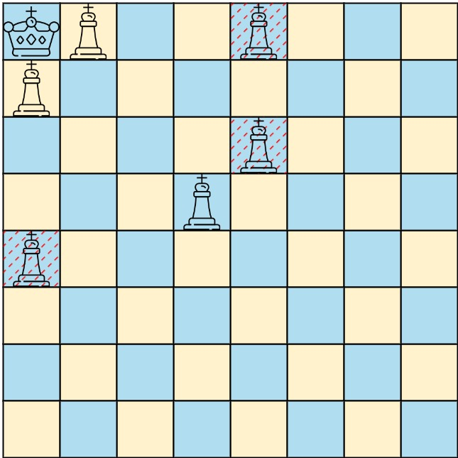
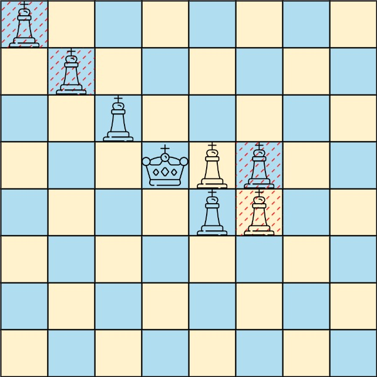

# 1222 Queens That Can Attack the King

On a 0-indexed 8 x 8 chessboard, there can be multiple black queens and one white king.

You are given a 2D integer array queens where queens[i] = [xQueeni, yQueeni] represents the position of the ith black queen on the chessboard. You are also given an integer array king of length 2 where king = [xKing, yKing] represents the position of the white king.

Return the coordinates of the black queens that can directly attack the king. You may return the answer in any order.
 
[LeetCode](https://leetcode.cn/problems/remove-all-adjacent-duplicates-in-string-ii/)

### Example 1



```
Input: queens = [[0,1],[1,0],[4,0],[0,4],[3,3],[2,4]], king = [0,0]
Output: [[0,1],[1,0],[3,3]]
Explanation: The diagram above shows the three queens that can directly attack the king and the three queens that cannot attack the king (i.e., marked with red dashes).
```

### Example 2



```
Input: queens = [[0,0],[1,1],[2,2],[3,4],[3,5],[4,4],[4,5]], king = [3,3]
Output: [[2,2],[3,4],[4,4]]
Explanation: The diagram above shows the three queens that can directly attack the king and the three queens that cannot attack the king (i.e., marked with red dashes).
```

### Constraints

* 1 <= queens.length < 64
* queens[i].length == king.length == 2
* 0 <= xQueeni, yQueeni, xKing, yKing < 8
* All the given positions are unique.

### C++ 

```
class Solution {
public:
    vector<vector<int>> queensAttacktheKing(vector<vector<int>>& queens, vector<int>& king) {
        /*
            以國王為出發點，分走朝8個方向走，若碰到皇后則記下並停止，若碰到邊界即停止
            為方便查詢，將皇后位置hash
        */
        const int& HASH = 8;
        int moves[8][2] = {{-1,0}, {1,0}, {0,-1}, {0,1}, {-1,-1}, {-1,1}, {1,-1}, {1,1}};
        unordered_set<int> positions;
        for(const vector<int>& queen : queens)
            positions.insert(queen[0] * HASH + queen[1]);
        
        vector<vector<int>> ret;
        for(int i = 0; i < 8; ++i){
            int row = king[0];
            int col = king[1];
            while(row >= 0 && row < HASH && col >= 0 && col < HASH){
                row += moves[i][0];
                col += moves[i][1];
                if(row >= 0 && row < HASH && col >= 0 && col < HASH && positions.contains(row * HASH + col)){
                    ret.emplace_back(vector<int>{row, col});
                    break;
                }
            }
        }
        
        return ret;
    }
};
```