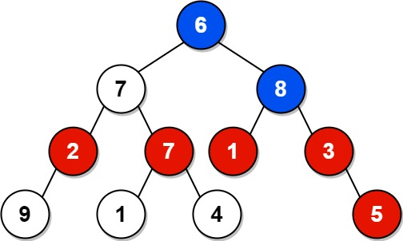

# 1315 Sum of Nodes with Even-Valued Grandparent

Given the root of a binary tree, return the sum of values of nodes with an even-valued grandparent. If there are no nodes with an even-valued grandparent, return 0.

A grandparent of a node is the parent of its parent if it exists.

[LeetCode](https://leetcode.cn/problems/xor-queries-of-a-subarray/description/)

### Example 1



```
Input: root = [6,7,8,2,7,1,3,9,null,1,4,null,null,null,5]
Output: 18
Explanation: The red nodes are the nodes with even-value grandparent while the blue nodes are the even-value grandparents.
```

### Example 2


```
Input: root = [1]
Output: 0
```

### Constraints

* The number of nodes in the tree is in the range [1, 104].
* 1 <= Node.val <= 100

### C++ 

```
/**
 * Definition for a binary tree node.
 * struct TreeNode {
 *     int val;
 *     TreeNode *left;
 *     TreeNode *right;
 *     TreeNode() : val(0), left(nullptr), right(nullptr) {}
 *     TreeNode(int x) : val(x), left(nullptr), right(nullptr) {}
 *     TreeNode(int x, TreeNode *left, TreeNode *right) : val(x), left(left), right(right) {}
 * };
 */
class Solution {
protected:
    pair<int,int> postOrder(TreeNode* root, int& ret){
        if(root == nullptr)
            return pair<int,int>(0,0);
        
        pair<int,int>&& leftBranch = postOrder(root->left, ret);
        pair<int,int>&& rightBranch = postOrder(root->right, ret);

        if((root->val & 1) == 0)
            ret += leftBranch.second + rightBranch.second;
        
        return pair<int,int>(root->val, leftBranch.first + rightBranch.first);
    }
public:
    int sumEvenGrandparent(TreeNode* root) {
        /*
            postOrder 回傳自己的值以及子節點的合
        */
        int ret = 0;

        postOrder(root, ret);

        return ret;        
    }
};
```