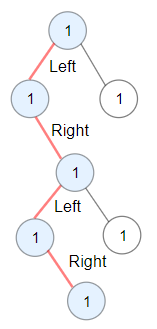

# 1372 Find the Longest Substring Containing Vowels in Even Counts

You are given the root of a binary tree.

A ZigZag path for a binary tree is defined as follow:

* Choose any node in the binary tree and a direction (right or left).
* If the current direction is right, move to the right child of the current node; otherwise, move to the left child.
* Change the direction from right to left or from left to right.
* Repeat the second and third steps until you can't move in the tree.
Zigzag length is defined as the number of nodes visited - 1. (A single node has a length of 0).

Return the longest ZigZag path contained in that tree.

[LeetCode](https://leetcode.cn/problems/longest-zigzag-path-in-a-binary-tree/description/)

### Example 1


```
Input: root = [1,null,1,1,1,null,null,1,1,null,1,null,null,null,1]
Output: 3
Explanation: Longest ZigZag path in blue nodes (right -> left -> right).
```

### Example 2



```
Input: root = [1,1,1,null,1,null,null,1,1,null,1]
Output: 4
Explanation: Longest ZigZag path in blue nodes (left -> right -> left -> right).
```

### Constraints

* The number of nodes in the tree is in the range [1, 5 * 104].
* 1 <= Node.val <= 100

### C++ 

```
/**
 * Definition for a binary tree node.
 * struct TreeNode {
 *     int val;
 *     TreeNode *left;
 *     TreeNode *right;
 *     TreeNode() : val(0), left(nullptr), right(nullptr) {}
 *     TreeNode(int x) : val(x), left(nullptr), right(nullptr) {}
 *     TreeNode(int x, TreeNode *left, TreeNode *right) : val(x), left(left), right(right) {}
 * };
 */
class Solution {
protected:
    void preOrder(int& ret, const int& currLen, const bool& fromRight, TreeNode* root){
        if(root == nullptr)
            return;
        
        ret = max(ret, currLen);
        if(fromRight == true){ //代表前一個節點往分支走
            preOrder(ret, 2,  true, root->right); //繼續往右走
            preOrder(ret, currLen + 1, false, root->left);
        } else { //前一個節點往左子分支赹
            preOrder(ret, currLen + 1, true, root->right);
            preOrder(ret, 2, false, root->left);
        }
    }
public:
    int longestZigZag(TreeNode* root) {
        if(root == nullptr)
            return 0;
        /*
            每一個節點會受到
            1. 來的方向來決定之後的方向怎樣是有效的
            故，如果來的方向是右，接著右方可以繼續走，長度要重新計算
                                  接著左方可以繼續走，長度累計
        */
        int ret = 1;
        int currLen = 1;

        preOrder(ret, currLen + 1, true, root->right);
        preOrder(ret, currLen + 1, false, root->left);
        
        return ret - 1;
    }
};
```