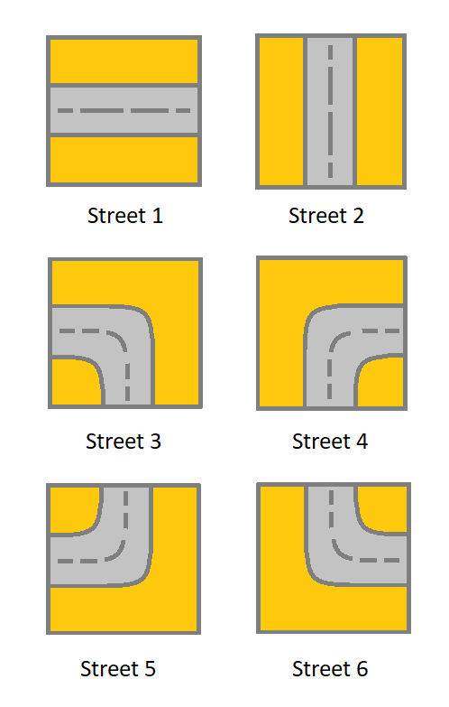

# 1391 Check if There is a Valid Path in a Grid

You are given an m x n grid. Each cell of grid represents a street. The street of grid[i][j] can be:

* 1 which means a street connecting the left cell and the right cell.
* 2 which means a street connecting the upper cell and the lower cell.
* 3 which means a street connecting the left cell and the lower cell.
* 4 which means a street connecting the right cell and the lower cell.
* 5 which means a street connecting the left cell and the upper cell.
* 6 which means a street connecting the right cell and the upper cell.



You will initially start at the street of the upper-left cell (0, 0). A valid path in the grid is a path that starts from the upper left cell (0, 0) and ends at the bottom-right cell (m - 1, n - 1). The path should only follow the streets.

Notice that you are not allowed to change any street.

Return true if there is a valid path in the grid or false otherwise.

[LeetCode](https://leetcode.cn/problems/four-divisors/description/)

### Example 1


```
Input: grid = [[2,4,3],[6,5,2]]
Output: true
Explanation: As shown you can start at cell (0, 0) and visit all the cells of the grid to reach (m - 1, n - 1).
```

### Example 2


```
Input: grid = [[1,2,1],[1,2,1]]
Output: false
Explanation: As shown you the street at cell (0, 0) is not connected with any street of any other cell and you will get stuck at cell (0, 0)
```

### Constraints

* m == grid.length
* n == grid[i].length
* 1 <= m, n <= 300
* 1 <= grid[i][j] <= 6


### C++ 

```
class Solution {
public:
    bool hasValidPath(vector<vector<int>>& grid) {
        /*
            思考方式：
            1. 由當下的圖案，可以決定可以前往的方向
            2. 可以前往的方向是也必需是特定的圖案才能走得到
            需求的數據結構
            當下的圖案，移動的方向unordered_map<int,int>
            移動的方向，可踩上的下一點unordered_map<int,int>
            3. 使用BFS拓展
        */
        int&& rowNum = grid.size();
        int&& colNum = grid[0].size();
        if(rowNum == 1 && colNum == 1)
            return true;

        int moves[4][2] = {{-1,0},{1,0},{0,-1},{0,1}};
        vector<vector<int>> nextMove = {{},{2,3},{0,1},{1,2},{1,3},{0,2},{0,3}};
        vector<unordered_set<int>> nextBlock = {{2,3,4},{2,5,6},{1,4,6},{1,3,5}};

        typedef pair<int,int> iPair;
        queue<iPair> que;
        que.emplace(0, 0);

        while(que.empty() != true){
            iPair curr = move(que.front());
            que.pop();
            int mapId = grid[curr.first][curr.second];
            if(mapId == -1)
                continue;
            grid[curr.first][curr.second] = -1;
            const vector<int>& dir = nextMove[mapId];
            for(const int& next : dir){
                int&& nextRow = curr.first + moves[next][0];
                int&& nextCol = curr.second + moves[next][1];
                if(nextRow >= 0 && nextRow < rowNum && nextCol >= 0 && nextCol < colNum && nextBlock[next].contains(grid[nextRow][nextCol])){
                    if(nextRow == rowNum - 1 && nextCol == colNum - 1)  
                        return true; 
                    que.emplace(nextRow, nextCol);
                }
            }
        }

        return false;        
    }
};
```