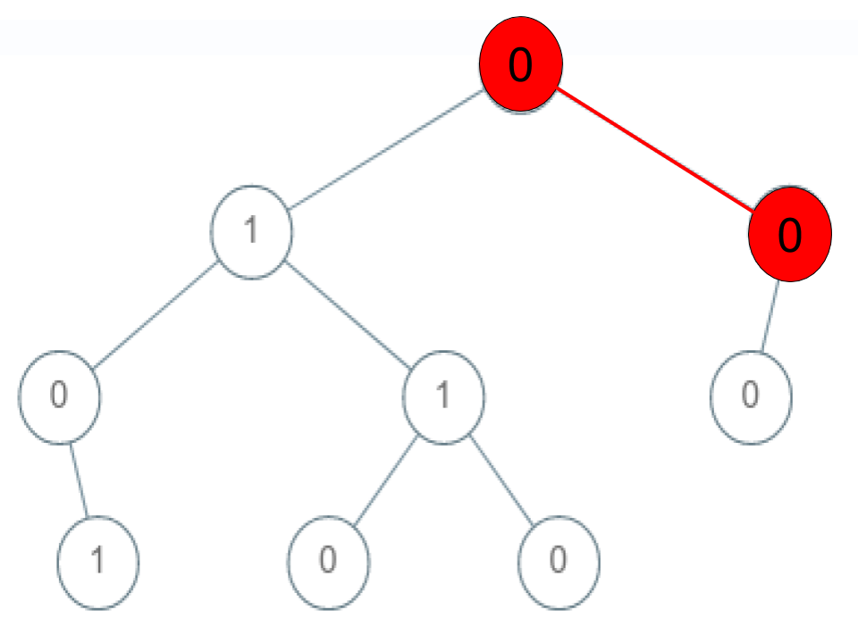

# 1430 Check If a String Is a Valid Sequence from Root to Leaves Path in a Binary Tree

You have a queue of integers, you need to retrieve the first unique integer in the queue.

Implement the FirstUnique class:

FirstUnique(int[] nums) Initializes the object with the numbers in the queue.
int showFirstUnique() returns the value of the first unique integer of the queue, and returns -1 if there is no such integer.
void add(int value) insert value to the queue.

[LeetCode](https://leetcode.cn/problems/check-if-a-string-is-a-valid-sequence-from-root-to-leaves-path-in-a-binary-tree/description/)

### Example 1


```
Input: root = [0,1,0,0,1,0,null,null,1,0,0], arr = [0,1,0,1]
Output: true
Explanation: 
The path 0 -> 1 -> 0 -> 1 is a valid sequence (green color in the figure). 
Other valid sequences are: 
0 -> 1 -> 1 -> 0 
0 -> 0 -> 0
```

### Example 2



```
Input: root = [0,1,0,0,1,0,null,null,1,0,0], arr = [0,0,1]
Output: false 
Explanation: The path 0 -> 0 -> 1 does not exist, therefore it is not even a sequence.
```

### Constraints

* 1 <= arr.length <= 5000
* 0 <= arr[i] <= 9
* Each node's value is between [0 - 9].


### C++ 

```
/**
 * Definition for a binary tree node.
 * struct TreeNode {
 *     int val;
 *     TreeNode *left;
 *     TreeNode *right;
 *     TreeNode() : val(0), left(nullptr), right(nullptr) {}
 *     TreeNode(int x) : val(x), left(nullptr), right(nullptr) {}
 *     TreeNode(int x, TreeNode *left, TreeNode *right) : val(x), left(left), right(right) {}
 * };
 */
class Solution {
protected:
    bool preOrder(TreeNode* root, const vector<int>& arr, const int& target, const int& pos){
        if(pos == target || root->val != arr[pos])
            return false;
        else if(root->left == nullptr && root->right == nullptr && target - 1 == pos)
           return true;        
        
        if(root->left != nullptr && preOrder(root->left, arr, target, pos + 1))
            return true;

        if(root->right != nullptr && preOrder(root->right, arr, target, pos + 1))  
            return true;  
        
        return false;
    }
public:
    bool isValidSequence(TreeNode* root, vector<int>& arr) {
        /*
            以前序遍曆的方式遍歷整個
        */
        if(root == nullptr)
            return false;
        int pos = 0;
        
        return preOrder(root, arr, arr.size(), 0); 
    }
};
```