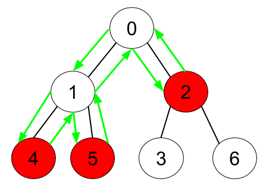

# 1443 Minimum Time to Collect All Apples in a Tree

Given an undirected tree consisting of n vertices numbered from 0 to n-1, which has some apples in their vertices. You spend 1 second to walk over one edge of the tree. Return the minimum time in seconds you have to spend to collect all apples in the tree, starting at vertex 0 and coming back to this vertex.

The edges of the undirected tree are given in the array edges, where edges[i] = [ai, bi] means that exists an edge connecting the vertices ai and bi. Additionally, there is a boolean array hasApple, where hasApple[i] = true means that vertex i has an apple; otherwise, it does not have any apple.

[LeetCode](https://leetcode.cn/problems/minimum-time-to-collect-all-apples-in-a-tree/description/)

### Example 1



```
Input: s1 = "abc", s2 = "xya"
Output: true
Explanation: "ayx" is a permutation of s2="xya" which can break to string "abc" which is a permutation of s1="abc".
```

### Example 2


```
Input: s1 = "abe", s2 = "acd"
Output: false 
Explanation: All permutations for s1="abe" are: "abe", "aeb", "bae", "bea", "eab" and "eba" and all permutation for s2="acd" are: "acd", "adc", "cad", "cda", "dac" and "dca". However, there is not any permutation from s1 which can break some permutation from s2 and vice-versa.
```

### Constraints

* 1 <= n <= 105
* edges.length == n - 1
* edges[i].length == 2
* 0 <= ai < bi <= n - 1
* hasApple.length == n


### C++ 

```
class Solution {
protected:
    int postOrder(const int& pos, unordered_map<int, vector<int>>& route, vector<bool>& hasApple, vector<int>& visted){
        int ret = 0;
        
        //下一個點
        for(int& next : route[pos]){
            if(visted[next] != true){
                visted[next] = true;
                ret += postOrder(next, route, hasApple, visted);
            }
        }

        if((ret != 0 || hasApple[pos] == true) && pos != 0)
            ret += 2;

        return ret;
    }
public:
    int minTime(int n, vector<vector<int>>& edges, vector<bool>& hasApple) {
        /*
            使用後續遍歷
            回傳的值為 ret
            若自己有蘋果 ret += 2(由前一個點來回該點)
            ret +=左右子樹的回傳值
        */
        unordered_map<int, vector<int>> route;
        for(const vector<int>& edge : edges){
            route[edge[0]].push_back(edge[1]);
            route[edge[1]].push_back(edge[0]);
        }

        vector<int> visted(n);
        visted[0] = true;
        return postOrder(0, route, hasApple, visted);
    }
};
```