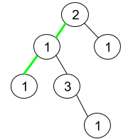

# 1457 Pseudo-Palindromic Paths in a Binary Tree

Given a binary tree where node values are digits from 1 to 9. A path in the binary tree is said to be pseudo-palindromic if at least one permutation of the node values in the path is a palindrome.

Return the number of pseudo-palindromic paths going from the root node to leaf nodes.

[LeetCode](https://leetcode.cn/problems/pseudo-palindromic-paths-in-a-binary-tree/description/)

### Example 1


```
Input: root = [2,3,1,3,1,null,1]
Output: 2 
Explanation: The figure above represents the given binary tree. There are three paths going from the root node to leaf nodes: the red path [2,3,3], the green path [2,1,1], and the path [2,3,1]. Among these paths only red path and green path are pseudo-palindromic paths since the red path [2,3,3] can be rearranged in [3,2,3] (palindrome) and the green path [2,1,1] can be rearranged in [1,2,1] (palindrome).
```

### Example 2



```
Input: root = [2,1,1,1,3,null,null,null,null,null,1]
Output: 1 
Explanation: The figure above represents the given binary tree. There are three paths going from the root node to leaf nodes: the green path [2,1,1], the path [2,1,3,1], and the path [2,1]. Among these paths only the green path is pseudo-palindromic since [2,1,1] can be rearranged in [1,2,1] (palindrome).
```

### Constraints

* The number of nodes in the tree is in the range [1, 10<sup>5</sup>].
* 1 <= Node.val <= 9

### C++ 

```
/**
 * Definition for a binary tree node.
 * struct TreeNode {
 *     int val;
 *     TreeNode *left;
 *     TreeNode *right;
 *     TreeNode() : val(0), left(nullptr), right(nullptr) {}
 *     TreeNode(int x) : val(x), left(nullptr), right(nullptr) {}
 *     TreeNode(int x, TreeNode *left, TreeNode *right) : val(x), left(left), right(right) {}
 * };
 */
class Solution {
protected:
    int preOrder(TreeNode*& root, int& pathLen, int& state){        
        int ret = 0;
        state ^= 1 << root->val;
        ++pathLen;

        if(root->left == nullptr && root->right == nullptr){
            if(state == 0 ||((state == (state & -state)) && (pathLen & 1)))
                ret += 1;
            state ^= 1 << root->val;
            ++pathLen;
            return ret;
        }

        if(root->left != nullptr)
            ret += preOrder(root->left, pathLen, state);
        if(root->right != nullptr)
            ret += preOrder(root->right, pathLen, state);

        --pathLen;
        state ^= 1 << root->val;

        return ret;
    }

public:
    int pseudoPalindromicPaths (TreeNode* root) {
        /*
            從根節點到葉子節點，其數字的組成能拼成回文串
            數字僅限1 - 9
            1. 檢查有幾個數字出現奇數次，若0個則為回文串，若有1個且長度為奇數亦可為回文串
               其他的不可成為回文串
        */

        int pathLen = 0;
        int state = 0;

        return preOrder(root, pathLen, state);        
    }
};
```