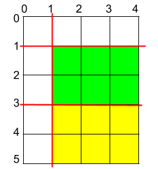

# 1465 Maximum Area of a Piece of Cake After Horizontal and Vertical Cuts

You are given a rectangular cake of size h x w and two arrays of integers horizontalCuts and verticalCuts where:

horizontalCuts[i] is the distance from the top of the rectangular cake to the ith horizontal cut and similarly, and
verticalCuts[j] is the distance from the left of the rectangular cake to the jth vertical cut.
Return the maximum area of a piece of cake after you cut at each horizontal and vertical position provided in the arrays horizontalCuts and verticalCuts. Since the answer can be a large number, return this modulo 109 + 7.

[LeetCode](https://leetcode.cn/problems/maximum-area-of-a-piece-of-cake-after-horizontal-and-vertical-cuts/description/)

### Example 1


```
Input: h = 5, w = 4, horizontalCuts = [1,2,4], verticalCuts = [1,3]
Output: 4 
Explanation: The figure above represents the given rectangular cake. Red lines are the horizontal and vertical cuts. After you cut the cake, the green piece of cake has the maximum area.
```


### Example 2



```
Input: h = 5, w = 4, horizontalCuts = [3,1], verticalCuts = [1]
Output: 6
Explanation: The figure above represents the given rectangular cake. Red lines are the horizontal and vertical cuts. After you cut the cake, the green and yellow pieces of cake have the maximum area.
```

### Constraints

* 2 <= h, w <= 109
* 1 <= horizontalCuts.length <= min(h - 1, 105)
* 1 <= verticalCuts.length <= min(w - 1, 105)
* 1 <= horizontalCuts[i] < h
* 1 <= verticalCuts[i] < w
* All the elements in horizontalCuts are distinct.
* All the elements in verticalCuts are distinct.

### C++ 

```
class Solution {
public:
    int maxArea(int h, int w, vector<int>& horizontalCuts, vector<int>& verticalCuts) {
        /*
            因為這一題是一口氣切完
            我們只要找出切完後最長的寬及高度及可
            我們加入邊界以方便取得每一段的長度
        */
        constexpr int MOD = 1E9 + 7;
        horizontalCuts.push_back(0);
        horizontalCuts.push_back(h);
        verticalCuts.push_back(0);
        verticalCuts.push_back(w);

        sort(horizontalCuts.begin(), horizontalCuts.end());
        sort(verticalCuts.begin(), verticalCuts.end());

        int maxHeight = 0;
        for(int i = 1; i < horizontalCuts.size(); ++i)
            maxHeight = max(maxHeight, horizontalCuts[i] - horizontalCuts[i - 1]);
        
        int maxWidth = 0;
        for(int i = 1; i < verticalCuts.size(); ++i)
            maxWidth = max(maxWidth, verticalCuts[i] - verticalCuts[i - 1]);

        return 1ll * maxHeight * maxWidth % MOD;
    }
};
```