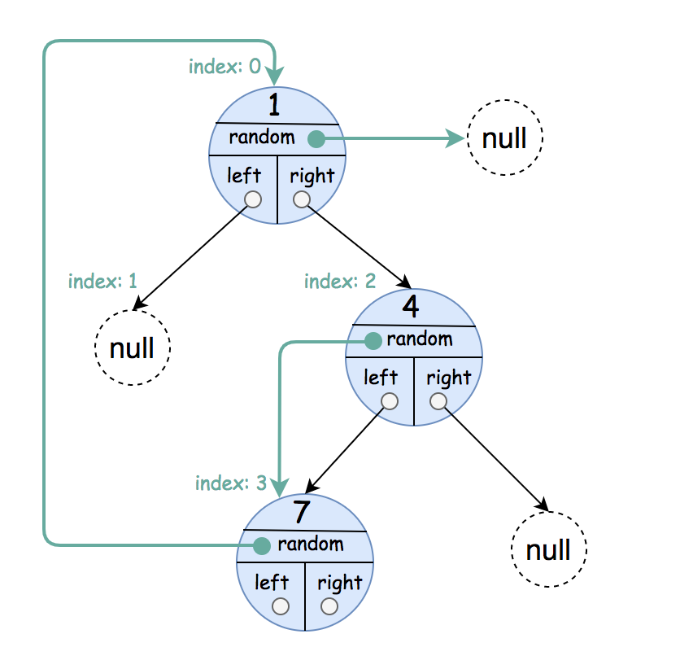

# 1485 Clone Binary Tree With Random Pointer

A binary tree is given such that each node contains an additional random pointer which could point to any node in the tree or null.

Return a deep copy of the tree.

The tree is represented in the same input/output way as normal binary trees where each node is represented as a pair of [val, random_index] where:

val: an integer representing Node.val
random_index: the index of the node (in the input) where the random pointer points to, or null if it does not point to any node.
You will be given the tree in class Node and you should return the cloned tree in class NodeCopy. NodeCopy class is just a clone of Node class with the same attributes and constructors.

[LeetCode](https://leetcode.cn/problems/clone-binary-tree-with-random-pointer/description/)

### Example 1



```
Input: root = [[1,null],null,[4,3],[7,0]]
Output: [[1,null],null,[4,3],[7,0]]
Explanation: The original binary tree is [1,null,4,7].
The random pointer of node one is null, so it is represented as [1, null].
The random pointer of node 4 is node 7, so it is represented as [4, 3] where 3 is the index of node 7 in the array representing the tree.
The random pointer of node 7 is node 1, so it is represented as [7, 0] where 0 is the index of node 1 in the array representing the tree.
```


### Example 2


```
Input: root = [[1,4],null,[1,0],null,[1,5],[1,5]]
Output: [[1,4],null,[1,0],null,[1,5],[1,5]]
Explanation: The random pointer of a node can be the node itself.
```

### Constraints

* The number of nodes in the tree is in the range [0, 1000].
* 1 <= Node.val <= 10<sup>6</sup>

### C++ 

```
/**
 * Definition for a Node.
 * struct Node {
 *     int val;
 *     Node *left;
 *     Node *right;
 *     Node *random;
 *     Node() : val(0), left(nullptr), right(nullptr), random(nullptr) {}
 *     Node(int x) : val(x), left(nullptr), right(nullptr), random(nullptr) {}
 *     Node(int x, Node *left, Node *right, Node *random) : val(x), left(left), right(right), random(random) {}
 * };
 */

class Solution {
protected:
    unordered_map<Node*, NodeCopy*> ori2copy;
    NodeCopy* copyTree(Node* root){
        if(root == nullptr)
            return nullptr;
        
        if(ori2copy.contains(root))
            return ori2copy[root];

        NodeCopy* copy = new NodeCopy(root->val);
        ori2copy[root] = copy;
        copy->random = copyTree(root->random);
        copy->left = copyTree(root->left);
        copy->right = copyTree(root->right);
        

        return copy;
    }
public:
    NodeCopy* copyRandomBinaryTree(Node* root) {
        /*
            因為有第三個random的節點，可能會有環存在
            使用記憶化，若某個節點已經出現過，直接返回該值
        */

        return copyTree(root);        
    }
};
```