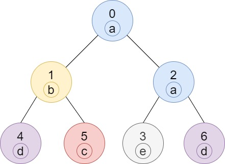

# 1519 Number of Nodes in the Sub-Tree With the Same Label

You are given a tree (i.e. a connected, undirected graph that has no cycles) consisting of n nodes numbered from 0 to n - 1 and exactly n - 1 edges. The root of the tree is the node 0, and each node of the tree has a label which is a lower-case character given in the string labels (i.e. The node with the number i has the label labels[i]).

The edges array is given on the form edges[i] = [ai, bi], which means there is an edge between nodes ai and bi in the tree.

Return an array of size n where ans[i] is the number of nodes in the subtree of the ith node which have the same label as node i.

A subtree of a tree T is the tree consisting of a node in T and all of its descendant nodes.

[LeetCode](https://leetcode.cn/problems/number-of-nodes-in-the-sub-tree-with-the-same-label/description/)

### Example 1



```
Input: n = 7, edges = [[0,1],[0,2],[1,4],[1,5],[2,3],[2,6]], labels = "abaedcd"
Output: [2,1,1,1,1,1,1]
Explanation: Node 0 has label 'a' and its sub-tree has node 2 with label 'a' as well, thus the answer is 2. Notice that any node is part of its sub-tree.
Node 1 has a label 'b'. The sub-tree of node 1 contains nodes 1,4 and 5, as nodes 4 and 5 have different labels than node 1, the answer is just 1 (the node itself).
```

### Example 2


```
Input: n = 4, edges = [[0,1],[1,2],[0,3]], labels = "bbbb"
Output: [4,2,1,1]
Explanation: The sub-tree of node 2 contains only node 2, so the answer is 1.
The sub-tree of node 3 contains only node 3, so the answer is 1.
The sub-tree of node 1 contains nodes 1 and 2, both have label 'b', thus the answer is 2.
The sub-tree of node 0 contains nodes 0, 1, 2 and 3, all with label 'b', thus the answer is 4.
```


### Constraints

* 1 <= n <= 105
* edges.length == n - 1
* edges[i].length == 2
* 0 <= ai, bi < n
* ai != bi
* labels.length == n
* labels is consisting of only of lowercase English letters.

### C++ 

```
class Solution {
protected:
    vector<int> postOrder(string& labels, vector<bool>& visted, unordered_map<int, vector<int>>& route, const int& pos, vector<int>& ret){
        vector<int> postCnt(26);

        visted[pos] = true;
        for(const int& next : route[pos]){
            if(visted[next] == true)
                continue;
            
            vector<int>&& tmp = postOrder(labels, visted, route, next, ret);
            for(int i = 0; i < 26; ++i)
                postCnt[i] += tmp[i];
        }

        ret[pos] = ++postCnt[labels[pos] - 'a'];

        return postCnt;
    }
public:
    vector<int> countSubTrees(int n, vector<vector<int>>& edges, string labels) {
        vector<bool> visted(n);
        unordered_map<int, vector<int>> route;
        for(const vector<int> edge : edges){
            route[edge[0]].push_back(edge[1]);
            route[edge[1]].push_back(edge[0]);
        }

        vector<int> ret(n);   
        (void)postOrder(labels, visted, route, 0, ret);
        
        return ret;
    }
};
```