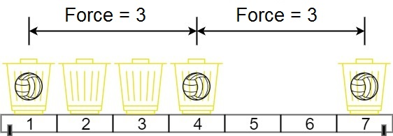

# 1552 Magnetic Force Between Two Balls

In the universe Earth C-137, Rick discovered a special form of magnetic force between two balls if they are put in his new invented basket. Rick has n empty baskets, the ith basket is at position[i], Morty has m balls and needs to distribute the balls into the baskets such that the minimum magnetic force between any two balls is maximum.

Rick stated that magnetic force between two different balls at positions x and y is |x - y|.

Given the integer array position and the integer m. Return the required force.

[LeetCode](https://leetcode.cn/problems/the-kth-factor-of-n/description/)

### Example 1



```
Input: position = [1,2,3,4,7], m = 3
Output: 3
Explanation: Distributing the 3 balls into baskets 1, 4 and 7 will make the magnetic force between ball pairs [3, 3, 6]. The minimum magnetic force is 3. We cannot achieve a larger minimum magnetic force than 3.
```


### Example 2

```
Input: position = [5,4,3,2,1,1000000000], m = 2
Output: 999999999
Explanation: We can use baskets 1 and 1000000000.
```

### Constraints

* n == position.length
* 2 <= n <= 105
* 1 <= position[i] <= 109
* All integers in position are distinct.
* 2 <= m <= position.length

### C++ 

```
class Solution {
protected:
    bool getBalls(const vector<int>& position, const int& dist, const int& m){
        int prev = position.front();
        int cnt = 1;
        for(int i = 1; i < position.size() && cnt < m; ++i){
            if(position[i] - prev >= dist){
                ++cnt;
                prev = position[i];
            }
        }

        return cnt >= m;
    }
public:
    int maxDistance(vector<int>& position, int m) {
        /*
            使用二分法，找出能放下M個球的最大距離
        */
        sort(position.begin(), position.end());
        int left = 1;
        int right = position.back();
        while(left < right){
            int&& mid = left + ((right - left + 1) >> 1);
            if(getBalls(position, mid, m) == true)
                left = mid;
            else
                right = mid - 1;
        }

        return left;
    }
};
```