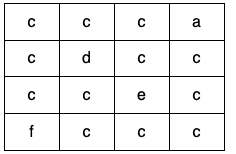

# 1559 Minimum Numbers of Function Calls to Make Target Array

Given a 2D array of characters grid of size m x n, you need to find if there exists any cycle consisting of the same value in grid.

A cycle is a path of length 4 or more in the grid that starts and ends at the same cell. From a given cell, you can move to one of the cells adjacent to it - in one of the four directions (up, down, left, or right), if it has the same value of the current cell.

Also, you cannot move to the cell that you visited in your last move. For example, the cycle (1, 1) -> (1, 2) -> (1, 1) is invalid because from (1, 2) we visited (1, 1) which was the last visited cell.

Return true if any cycle of the same value exists in grid, otherwise, return false.

[LeetCode](https://leetcode.cn/problems/the-kth-factor-of-n/description/)

### Example 1


```
Input: grid = [["a","a","a","a"],["a","b","b","a"],["a","b","b","a"],["a","a","a","a"]]
Output: true
Explanation: There are two valid cycles shown in different colors in the image below:
```


### Example 2




```
Input: nums = [2,2]
Output: 3
Explanation: Increment by 1 (both elements) [0, 0] -> [0, 1] -> [1, 1] (2 operations).
Double all the elements: [1, 1] -> [2, 2] (1 operation).
Total of operations: 2 + 1 = 3.
```


### Constraints

* m == grid.length
* n == grid[i].length
* 1 <= m, n <= 500
* grid consists only of lowercase English letters.

### C++ 

```
class Solution {
protected:
    vector<int> parent;
    int unionFind(const int& a){
        if(parent[a] != a)
            parent[a] = unionFind(parent[a]);
        return parent[a];
    }

    bool unionSet(int a, int b){
        a = unionFind(a);
        b = unionFind(b);
        if(a == b)
            return false;
        
        if(a > b)
            swap(a, b);
                                                                  
        parent[b] = a;
        return true;
    }
public:
    bool containsCycle(vector<vector<char>>& grid) {
        /*
            使用並查集，若兩個相鄰點的值相同，可代表其中間存在一條無向邊
            設定一為parent，若有兩個點都有同樣的parent代表圖中有環
            # 如何決定何為parent，若一個點與其左邊，或其上方的點可聯通，令其左方/上方為parent
        */
        int&& rowNum = grid.size();
        int&& colNum = grid[0].size();
        parent.resize(rowNum * colNum);
        iota(parent.begin(), parent.end(), 0);
        auto getId = [&colNum](int a, int b)->int{
            return a * colNum + b;
        };

        for(int row = 0; row < rowNum; ++row){
            for(int col = 0; col < colNum; ++col){
                if(row > 0 && grid[row - 1][col] == grid[row][col]){
                    if(unionSet(getId(row - 1, col), getId(row, col)) == false)
                        return true;
                }

                if(col > 0 && grid[row][col - 1] == grid[row][col]){
                    if(unionSet(getId(row, col - 1), getId(row, col)) == false)
                        return true;
                }

            }
        }


        return false;        
    }
};
```