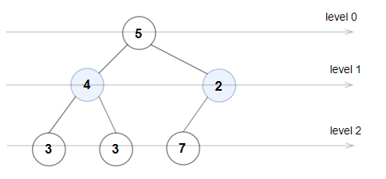

# 1609 Even Odd Tree

A binary tree is named Even-Odd if it meets the following conditions:

* The root of the binary tree is at level index 0, its children are at level index 1, their children are at level index 2, etc.
* For every even-indexed level, all nodes at the level have odd integer values in strictly increasing order (from left to right).
* For every odd-indexed level, all nodes at the level have even integer values in strictly decreasing order (from left to right).
Given the root of a binary tree, return true if the binary tree is Even-Odd, otherwise return false.

[LeetCode](https://leetcode.cn/problems/even-odd-tree/description/)

### Example 1


```
Input: root = [1,10,4,3,null,7,9,12,8,6,null,null,2]
Output: true
Explanation: The node values on each level are:
Level 0: [1]
Level 1: [10,4]
Level 2: [3,7,9]
Level 3: [12,8,6,2]
Since levels 0 and 2 are all odd and increasing and levels 1 and 3 are all even and decreasing, the tree is Even-Odd.
```

### Example 2



```
Input: root = [5,4,2,3,3,7]
Output: false
Explanation: The node values on each level are:
Level 0: [5]
Level 1: [4,2]
Level 2: [3,3,7]
Node values in level 2 must be in strictly increasing order, so the tree is not Even-Odd.
```

### Constraints

* The number of nodes in the tree is in the range [1, 10<sup>5</sup>].
* 1 <= Node.val <= 10<sup>6</sup>

### C++ 

```
/**
 * Definition for a binary tree node.
 * struct TreeNode {
 *     int val;
 *     TreeNode *left;
 *     TreeNode *right;
 *     TreeNode() : val(0), left(nullptr), right(nullptr) {}
 *     TreeNode(int x) : val(x), left(nullptr), right(nullptr) {}
 *     TreeNode(int x, TreeNode *left, TreeNode *right) : val(x), left(left), right(right) {}
 * };
 */
class Solution {
protected:
    bool isValid(const int& lv, int& lastNum, TreeNode* root){
        if(lv & 1)
            return root->val < lastNum && !(root->val & 1);
        else
            return root->val > lastNum && root->val & 1;
    }

public:
    bool isEvenOddTree(TreeNode* root) {
        if((root->val & 1) == 0)
            return false;
        /*
            要一層一層的看符不符合規定，聯想到BFS
        */
        constexpr int evenStart = 0;
        constexpr int oddStart = INT_MAX;
        queue<TreeNode*> que;
        que.push(root);
        int lv = 0;

        while(que.empty() != true){
            int&& len = que.size();
            int lastNum = evenStart;
            if(lv + 1 & 1)
                lastNum = oddStart;

            while(len--){
                TreeNode* curr = move(que.front());
                que.pop();
                if(curr->left != nullptr){
                    if(isValid(lv + 1, lastNum, curr->left) == false)
                        return false;
                    lastNum = curr->left->val;
                    que.push(curr->left);
                }

                if(curr->right != nullptr){
                    if(isValid(lv + 1, lastNum, curr->right) == false)
                        return false;
                    lastNum = curr->right->val;
                    que.push(curr->right);
                }
            }
            ++lv;
        }

        return true;        
    }
};
```