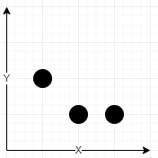

# 1620 Coordinate With Maximum Network Quality

You are given an array of network towers towers, where towers[i] = [xi, yi, qi] denotes the ith network tower with location (xi, yi) and quality factor qi. All the coordinates are integral coordinates on the X-Y plane, and the distance between the two coordinates is the Euclidean distance.

You are also given an integer radius where a tower is reachable if the distance is less than or equal to radius. Outside that distance, the signal becomes garbled, and the tower is not reachable.

The signal quality of the ith tower at a coordinate (x, y) is calculated with the formula ⌊qi / (1 + d)⌋, where d is the distance between the tower and the coordinate. The network quality at a coordinate is the sum of the signal qualities from all the reachable towers.

Return the array [cx, cy] representing the integral coordinate (cx, cy) where the network quality is maximum. If there are multiple coordinates with the same network quality, return the lexicographically minimum non-negative coordinate.

Note:

* A coordinate (x1, y1) is lexicographically smaller than (x2, y2) if either:
    * x1 < x2, or
    * x1 == x2 and y1 < y2.
* ⌊val⌋ is the greatest integer less than or equal to val (the floor function).

[LeetCode](https://leetcode.cn/problems/coordinate-with-maximum-network-quality/description/)

### Example 1



```
Input: towers = [[1,2,5],[2,1,7],[3,1,9]], radius = 2
Output: [2,1]
Explanation: At coordinate (2, 1) the total quality is 13.
- Quality of 7 from (2, 1) results in ⌊7 / (1 + sqrt(0)⌋ = ⌊7⌋ = 7
- Quality of 5 from (1, 2) results in ⌊5 / (1 + sqrt(2)⌋ = ⌊2.07⌋ = 2
- Quality of 9 from (3, 1) results in ⌊9 / (1 + sqrt(1)⌋ = ⌊4.5⌋ = 4
No other coordinate has a higher network quality.
```

### Example 2

```
Input: towers = [[23,11,21]], radius = 9
Output: [23,11]
Explanation: Since there is only one tower, the network quality is highest right at the tower's location.
```

### Constraints

* 1 <= towers.length <= 50
* towers[i].length == 3
* 0 <= xi, yi, qi <= 50
* 1 <= radius <= 50

### C++ 

```
class Solution {
public:
    vector<int> bestCoordinate(vector<vector<int>>& towers, int radius) {
        /*
            信號塔總數 <= 50 ，半徑 <= 50
            選取一個範圍，計算範圍內的所有點的信號大小
            只要準個一個50 x 50的正方型即可
        */
        vector<vector<int>> matrix(51, vector<int>(51));
        int maxQuality = 0;
        int&& radiusSquare = radius * radius;
        vector<int>ret{0,0};

        // 遍歷每一座信號塔
        for(const vector<int>& tower : towers){
            for(int row = max(0, tower[0] - radius); row <= min(50, tower[0] + radius); ++row){
                for(int col = max(0, tower[1] - radius); col <= min(50, tower[1] + radius); ++col){
                    int&& dist = pow(row  - tower[0], 2) + pow(col - tower[1], 2);
                    if(dist > radiusSquare)
                        continue;

                    int netQuality = tower[2] / (1.0 + sqrt(dist));
                    matrix[row][col] += netQuality;
                    if(matrix[row][col] > maxQuality){
                        maxQuality = matrix[row][col];
                        ret[0] = row;
                        ret[1] = col;
                    } else if(matrix[row][col] == maxQuality && (row < ret[0] || (row == ret[0] && col < ret[1]))){
                        ret[0] = row;
                        ret[1] = col;
                    }
                }
            }
        }

        return ret;
    }
};
```