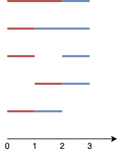

# 1621 Number of Sets of K Non-Overlapping Line Segments

Given n points on a 1-D plane, where the ith point (from 0 to n-1) is at x = i, find the number of ways we can draw exactly k non-overlapping line segments such that each segment covers two or more points. The endpoints of each segment must have integral coordinates. The k line segments do not have to cover all n points, and they are allowed to share endpoints.

Return the number of ways we can draw k non-overlapping line segments. Since this number can be huge, return it modulo 109 + 7.

[LeetCode](https://leetcode.cn/problems/number-of-sets-of-k-non-overlapping-line-segments/description/)

### Example 1



```
Input: n = 4, k = 2
Output: 5
Explanation: The two line segments are shown in red and blue.
The image above shows the 5 different ways {(0,2),(2,3)}, {(0,1),(1,3)}, {(0,1),(2,3)}, {(1,2),(2,3)}, {(0,1),(1,2)}.
```

### Example 2

```
Input: n = 3, k = 1
Output: 3
Explanation: The 3 ways are {(0,1)}, {(0,2)}, {(1,2)}.
```

### Constraints

* 2 <= n <= 1000
* 1 <= k <= n-1

### C++ 

```
class Solution {
    static constexpr int MOD = 1E9 + 7;
    int hash;
    unordered_map<int,int> visted;
    int nCr(int n, int r) {
        int&& hashNum = n * hash + r;
        if(visted.contains(hashNum))
            return visted[hashNum];

        if (r > n)
            return 0;
        if (r == 0 || r == n)
            return 1;
        
        int ret = nCr(n - 1, r - 1) % MOD + nCr(n - 1, r) % MOD;
        visted[hashNum] = ret;
        return visted[hashNum];
    }

public:
    int numberOfSets(int n, int k) {
        /*
            數學方式
            若每一個線段都沒有共有端點，共需要2K個點
            若所有線段都共用端點，總共有k - 2個共用當
            將這k - 2個點加入 N，選擇2K個點
            return c(n + k - 2, 2k);
        */
        hash = n + 1;

        int&& res = nCr(n + k - 1, 2 * k);
        
        return res % MOD;
    }
};
```