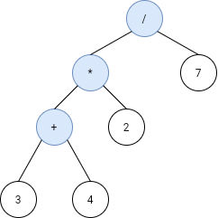

# 1628 Design an Expression Tree With Evaluate Function

Given the postfix tokens of an arithmetic expression, build and return the binary expression tree that represents this expression.

Postfix notation is a notation for writing arithmetic expressions in which the operands (numbers) appear before their operators. For example, the postfix tokens of the expression 4*(5-(7+2)) are represented in the array postfix = ["4","5","7","2","+","-","*"].

The class Node is an interface you should use to implement the binary expression tree. The returned tree will be tested using the evaluate function, which is supposed to evaluate the tree's value. You should not remove the Node class; however, you can modify it as you wish, and you can define other classes to implement it if needed.

A binary expression tree is a kind of binary tree used to represent arithmetic expressions. Each node of a binary expression tree has either zero or two children. Leaf nodes (nodes with 0 children) correspond to operands (numbers), and internal nodes (nodes with two children) correspond to the operators '+' (addition), '-' (subtraction), '*' (multiplication), and '/' (division).

It's guaranteed that no subtree will yield a value that exceeds 109 in absolute value, and all the operations are valid (i.e., no division by zero).

Follow up: Could you design the expression tree such that it is more modular? For example, is your design able to support additional operators without making changes to your existing evaluate implementation?

[LeetCode](https://leetcode.cn/problems/design-an-expression-tree-with-evaluate-function/description/)

### Example 1



```
Input: s = ["3","4","+","2","*","7","/"]
Output: 2
Explanation: this expression evaluates to the above binary tree with expression ((3+4)*2)/7) = 14/7 = 2.
```

### Example 2


```
Input: s = ["4","5","2","7","+","-","*"]
Output: -16
Explanation: this expression evaluates to the above binary tree with expression 4*(5-(2+7)) = 4*(-4) = -16.
```

### Constraints

* 1 <= s.length < 100
* s.length is odd.
* s consists of numbers and the characters '+', '-', '*', and '/'.
* If s[i] is a number, its integer representation is no more than 105.
* It is guaranteed that s is a valid expression.
* The absolute value of the result and intermediate values will not exceed 109.
* It is guaranteed that no expression will include division by zero.

### C++ 

```
/**
 * This is the interface for the expression tree Node.
 * You should not remove it, and you can define some classes to implement it.
 */

class Node {
public:
    bool isOperator(const string& str){
        return str == "+" || str == "-" || str == "*" || str == "/";
    }
    Node* left{nullptr};
    Node* right{nullptr};
    string str;
    Node(){}
    Node(const string& str):str(str){}
    virtual ~Node () {};
    int evaluate(){
        return postOrder(this);
    } ;

protected:   
    int postOrder(Node* root){
        if(isOperator(root->str) == false)
            return stoi(root->str);
        
        int&& left = postOrder(root->left);
        int&& right = postOrder(root->right);

        if(root->str == "+")
            return left + right;
        else if(root->str == "-")
            return left - right;
        else if(root->str == "*")
            return left * right;
        
        return left / right;
    }
    
};


/**
 * This is the TreeBuilder class.
 * You can treat it as the driver code that takes the postinfix input 
 * and returns the expression tree representing it as a Node.
 */

class TreeBuilder {
protected:
    
public:
    Node* buildTree(vector<string>& postfix) {
        if(postfix.size() == 1)
            
        // 
        Node* tmp = nullptr;
        stack<Node*> stk;    
        for(const string& str : postfix){
            Node* tmp = new Node(str);
            if(tmp->isOperator(str)){
                tmp->right = move(stk.top());
                stk.pop();
                tmp->left = move(stk.top());
                stk.pop();
            }
            stk.push(move(tmp));
        }
        
        return stk.top();
    }
};


/**
 * Your TreeBuilder object will be instantiated and called as such:
 * TreeBuilder* obj = new TreeBuilder();
 * Node* expTree = obj->buildTree(postfix);
 * int ans = expTree->evaluate();
 */
```