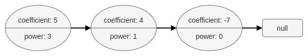
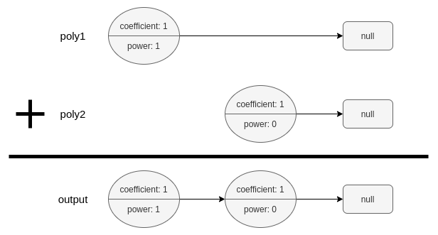

# 1634 Add Two Polynomials Represented as Linked Lists

A polynomial linked list is a special type of linked list where every node represents a term in a polynomial expression.

Each node has three attributes:

* coefficient: an integer representing the number multiplier of the term. The coefficient of the term 9x4 is 9.
* power: an integer representing the exponent. The power of the term 9x4 is 4.
* next: a pointer to the next node in the list, or null if it is the last node of the list.
For example, the polynomial 5x3 + 4x - 7 is represented by the polynomial linked list illustrated below:




The polynomial linked list must be in its standard form: the polynomial must be in strictly descending order by its power value. Also, terms with a coefficient of 0 are omitted.

Given two polynomial linked list heads, poly1 and poly2, add the polynomials together and return the head of the sum of the polynomials.

PolyNode format:

The input/output format is as a list of n nodes, where each node is represented as its [coefficient, power]. For example, the polynomial 5x3 + 4x - 7 would be represented as: [[5,3],[4,1],[-7,0]].

[LeetCode](https://leetcode.cn/problems/add-two-polynomials-represented-as-linked-lists/description/)

### Example 1



```
Input: poly1 = [[1,1]], poly2 = [[1,0]]
Output: [[1,1],[1,0]]
Explanation: poly1 = x. poly2 = 1. The sum is x + 1.
```

### Example 2

```
Input: poly1 = [[2,2],[4,1],[3,0]], poly2 = [[3,2],[-4,1],[-1,0]]
Output: [[5,2],[2,0]]
Explanation: poly1 = 2x2 + 4x + 3. poly2 = 3x2 - 4x - 1. The sum is 5x2 + 2. Notice that we omit the "0x" term.
```

### Constraints

* 0 <= n <= 10<sup>4</sup>
* -10<sup>9</sup> <= PolyNode.coefficient <= 10<sup>9</sup>
* PolyNode.coefficient != 0
* 0 <= PolyNode.power <= 10<sup>9</sup>
* PolyNode.power > PolyNode.next.power

### C++ 

```
/**
 * Definition for polynomial singly-linked list.
 * struct PolyNode {
 *     int coefficient, power;
 *     PolyNode *next;
 *     PolyNode(): coefficient(0), power(0), next(nullptr) {};
 *     PolyNode(int x, int y): coefficient(x), power(y), next(nullptr) {};
 *     PolyNode(int x, int y, PolyNode* next): coefficient(x), power(y), next(next) {};
 * };
 */

class Solution {
public:
    PolyNode* addPoly(PolyNode* poly1, PolyNode* poly2) {
        PolyNode* dummy = new PolyNode(-1,-1);
        PolyNode* tail = dummy;

        while(poly1 != nullptr || poly2 != nullptr){
            if(poly1 == nullptr || poly2 == nullptr){
                tail->next = poly1 == nullptr? poly2 : poly1;
                break;
            }

            if(poly1->power > poly2->power){
                tail->next = poly1;
                poly1 = poly1->next;
                tail = tail->next;
            } else if(poly1->power < poly2->power){
                tail->next = poly2;
                poly2 = poly2->next;
                tail = tail->next;
            } else{
                poly1->coefficient = poly1->coefficient + poly2->coefficient;
                if(poly1->coefficient != 0){
                    tail->next = poly1;
                    tail = tail->next;
                }                
                poly1 = poly1->next;
                poly2 = poly2->next;                
            }
            tail->next = nullptr;
            
        }

        return dummy->next;        
    }
};
```