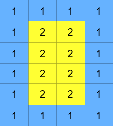
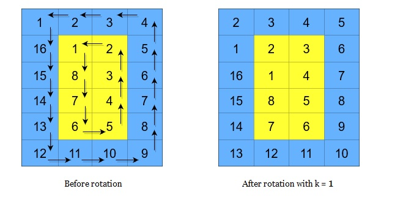

# 1914 Cyclically Rotating a Grid

You are given an m x n integer matrix grid​​​, where m and n are both even integers, and an integer k.

The matrix is composed of several layers, which is shown in the below image, where each color is its own layer:



A cyclic rotation of the matrix is done by cyclically rotating each layer in the matrix. To cyclically rotate a layer once, each element in the layer will take the place of the adjacent element in the counter-clockwise direction. An example rotation is shown below:



[LeetCode](https://leetcode.cn/problems/cyclically-rotating-a-grid/description/)

### Example 1

```
Input: maze = [["+","+",".","+"],[".",".",".","+"],["+","+","+","."]], entrance = [1,2]
Output: 1
Explanation: There are 3 exits in this maze at [1,0], [0,2], and [2,3].
Initially, you are at the entrance cell [1,2].
- You can reach [1,0] by moving 2 steps left.
- You can reach [0,2] by moving 1 step up.
It is impossible to reach [2,3] from the entrance.
Thus, the nearest exit is [0,2], which is 1 step away.
```

### Example 2

```
Input: maze = [["+","+","+"],[".",".","."],["+","+","+"]], entrance = [1,0]
Output: 2
Explanation: There is 1 exit in this maze at [1,2].
[1,0] does not count as an exit since it is the entrance cell.
Initially, you are at the entrance cell [1,0].
- You can reach [1,2] by moving 2 steps right.
Thus, the nearest exit is [1,2], which is 2 steps away.
```

### Constraints

* maze.length == m
* maze[i].length == n
* 1 <= m, n <= 100
* maze[i][j] is either '.' or '+'.
* entrance.length == 2
* 0 <= entrancerow < m
* 0 <= entrancecol < n
* entrance will always be an empty cell.


### C++ 

```
class Solution {
public:
    int nearestExit(vector<vector<char>>& maze, vector<int>& entrance) {
        /*
            使用BFS拓展，起始位置即使是在邊上，也不能當作出口
            ，將走過的位置改成 + 牆壁以認為走過
        */
        typedef pair<int, int> iPair;
        int moves[4][2] = {{-1,0}, {1,0},{0,-1},{0,1}};
        int&& rowNum = maze.size();
        int&& colNum = maze[0].size();

        queue<iPair> que;
        que.emplace(entrance[0], entrance[1]);
        maze[entrance[0]][entrance[1]] = '+';
        int ret = 0;

        while(que.empty() != true){
            int&& len = que.size();
            ++ret;
            while(len--){
                iPair curr = que.front();
                que.pop();
                
                for(int i = 0; i < 4; ++i){
                    int&& nxRow = curr.first + moves[i][0];
                    int&& nxCol = curr.second + moves[i][1];
                    if(nxRow >= 0 && nxRow < rowNum && nxCol >= 0 && nxCol < colNum && maze[nxRow][nxCol] != '+'){
                        if(nxRow == 0 || nxRow == rowNum - 1 || nxCol == 0 || nxCol == colNum - 1)
                            return ret;
                        maze[nxRow][nxCol] = '+';
                        que.emplace(nxRow, nxCol);
                    }
                }
            }
        }

        return -1;
    }
};
```