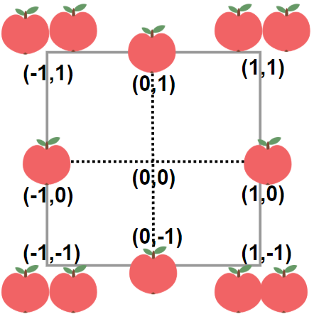

# 1954 Minimum Garden Perimeter to Collect Enough Apples

In a garden represented as an infinite 2D grid, there is an apple tree planted at every integer coordinate. The apple tree planted at an integer coordinate (i, j) has |i| + |j| apples growing on it.

You will buy an axis-aligned square plot of land that is centered at (0, 0).

Given an integer neededApples, return the minimum perimeter of a plot such that at least neededApples apples are inside or on the perimeter of that plot.

The value of |x| is defined as:

x if x >= 0
-x if x < 0

[LeetCode](https://leetcode.cn/problems/minimum-garden-perimeter-to-collect-enough-apples/description/)

### Example 1



```
Input: neededApples = 1
Output: 8
Explanation: A square plot of side length 1 does not contain any apples.
However, a square plot of side length 2 has 12 apples inside (as depicted in the image above).
The perimeter is 2 * 4 = 8.
```

### Example 2

```
Input: neededApples = 13
Output: 16
```

### Constraints

* 1 <= neededApples <= 10<sup>15</<sup>

### C++ 

```
class Solution {
public:
    long long minimumPerimeter(long long neededApples) {
        /*
            本題邊長為N的正方型，其數量為 2n(2n+1)(n+1)
            使用二分法查找:
            下限為1
            上限就設定為10^15的立方根 10^5
        */
        long long left = 1;
        long long right = 1E5;
        while(left < right){
            long long && mid = left + ((right - left) >> 1);
            if(2 * mid * (2 * mid + 1) * (mid + 1) >= neededApples)
                right = mid;
            else
                left = mid + 1;
        }

        return left * 8;        
    }
};
```