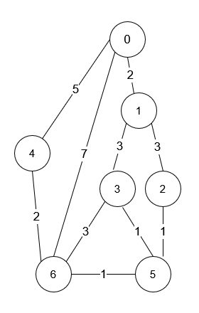

# 1976 Number of Ways to Arrive at Destination

You are in a city that consists of n intersections numbered from 0 to n - 1 with bi-directional roads between some intersections. The inputs are generated such that you can reach any intersection from any other intersection and that there is at most one road between any two intersections.

You are given an integer n and a 2D integer array roads where roads[i] = [ui, vi, timei] means that there is a road between intersections ui and vi that takes timei minutes to travel. You want to know in how many ways you can travel from intersection 0 to intersection n - 1 in the shortest amount of time.

Return the number of ways you can arrive at your destination in the shortest amount of time. Since the answer may be large, return it modulo 109 + 7.

[LeetCode](https://leetcode.cn/problems/number-of-ways-to-arrive-at-destination/description/)

### Example 1



```
Input: n = 7, roads = [[0,6,7],[0,1,2],[1,2,3],[1,3,3],[6,3,3],[3,5,1],[6,5,1],[2,5,1],[0,4,5],[4,6,2]]
Output: 4
Explanation: The shortest amount of time it takes to go from intersection 0 to intersection 6 is 7 minutes.
The four ways to get there in 7 minutes are:
- 0 ➝ 6
- 0 ➝ 4 ➝ 6
- 0 ➝ 1 ➝ 2 ➝ 5 ➝ 6
- 0 ➝ 1 ➝ 3 ➝ 5 ➝ 6
```

### Example 2

```
Input: n = 2, roads = [[1,0,10]]
Output: 1
Explanation: There is only one way to go from intersection 0 to intersection 1, and it takes 10 minutes.
```

### Constraints

* 1 <= n <= 200
* n - 1 <= roads.length <= n * (n - 1) / 2
* roads[i].length == 3
* 0 <= ui, vi <= n - 1
* 1 <= timei <= 109
* ui != vi
* There is at most one road connecting any two intersections.
* You can reach any intersection from any other intersection.

### C++ 

```
class Solution {
public:
    int countPaths(int n, vector<vector<int>>& roads) {
        /*
            1. 要如何得知到某點的最短時間: dijkstra算法
            2. 記錄到某點的最短時間，以及路徑數
        */
        constexpr int MOD = 1E9 + 7;
        typedef pair<long long, int> iPair; 

        //建立路網圖
        vector<vector<iPair>> route(n);
        for(const vector<int>& road : roads){
            route[road[0]].emplace_back(road[1], road[2]);
            route[road[1]].emplace_back(road[0], road[2]);
        }

        vector<long long> cost(n, LLONG_MAX);
        vector<int> pathCnt(n, 0);
        pathCnt[0] = 1;
        cost[0] = 0;

        priority_queue<iPair, vector<iPair>, greater<iPair>> priQue;
        priQue.emplace(0,0); //time, currNode
        while(!priQue.empty()){
            iPair curr = priQue.top();
            priQue.pop();
            if(curr.first > cost[curr.second])
                continue;
            for(const iPair& next : route[curr.second]){
                long long&& nextCost = curr.first + next.second;
                if(nextCost > cost[next.first])
                    continue;
                if(nextCost < cost[next.first]){ //到下一點的花費，小於目前下一點的花費
                    cost[next.first] = nextCost;
                    pathCnt[next.first] = pathCnt[curr.second];
                    priQue.emplace(nextCost, next.first);
                } else if(nextCost == cost[next.first]){
                    pathCnt[next.first] = (pathCnt[next.first] + pathCnt[curr.second]) % MOD;
                }
            }
        }

        return pathCnt[n - 1];
    }
};
```