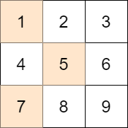

# 1981 Minimize the Difference Between Target and Chosen Elements

You are given an m x n integer matrix mat and an integer target.

Choose one integer from each row in the matrix such that the absolute difference between target and the sum of the chosen elements is minimized.

Return the minimum absolute difference.

The absolute difference between two numbers a and b is the absolute value of a - b.

[LeetCode](https://leetcode.cn/problems/minimize-the-difference-between-target-and-chosen-elements/description/)

### Example 1



```
Input: mat = [[1,2,3],[4,5,6],[7,8,9]], target = 13
Output: 0
Explanation: One possible choice is to:
- Choose 1 from the first row.
- Choose 5 from the second row.
- Choose 7 from the third row.
The sum of the chosen elements is 13, which equals the target, so the absolute difference is 0.
```

### Example 2

```
Input: mat = [[1],[2],[3]], target = 100
Output: 94
Explanation: The best possible choice is to:
- Choose 1 from the first row.
- Choose 2 from the second row.
- Choose 3 from the third row.
The sum of the chosen elements is 6, and the absolute difference is 94.
```

### Constraints

* m == mat.length
* n == mat[i].length
* 1 <= m, n <= 70
* 1 <= mat[i][j] <= 70
* 1 <= target <= 800

### C++ 

```
class Solution {
public:
    int minimizeTheDifference(vector<vector<int>>& mat, int target) {
        /*
            動態規劃，背包問題，可以計算出有限空間下能裝的最大數量
            但題目是要求最小差距，所以還需考量大於target時的情形:
            如果之前已經有大於target的情形出現了
            搭配mat[i]中的所有數字的更新最小的會超越target的情形
            有兩個變量，prevOverTarget, currOverTarget
            
        */  
        vector<bool> preDp(target + 1);
        preDp[0] = true;
        int prevMinOverTarg = INT_MAX;
        for(const vector<int> arr : mat){
            vector<bool> dp(target + 1);
            int currMinOverTarg = INT_MAX;
            for(const int& num : arr){
                for(int i = 0; i <= target; ++i){
                    if(preDp[i] != true)
                        continue;
                    if(i + num > target){
                        currMinOverTarg = min(currMinOverTarg, i + num);
                        break;
                    } else{
                        dp[i + num] = true;
                    }
                }

                if(prevMinOverTarg != INT_MAX) //在前一組已經大於target了有可能沒有比target小的合
                    currMinOverTarg = min(currMinOverTarg, prevMinOverTarg + num);
            }
            
            prevMinOverTarg = currMinOverTarg;
            preDp = move(dp);
        }

        int ret = prevMinOverTarg - target;
        for(int i = target; i >= 0; --i){
            if(preDp[i] == true){
                ret = min(ret, target - i);
                break;
            }
        }
        
        return ret;
    }
};
```