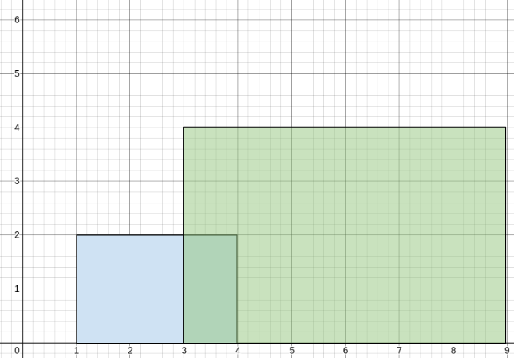

# 2015 Average Height of Buildings in Each Segment

A perfectly straight street is represented by a number line. The street has building(s) on it and is represented by a 2D integer array buildings, where buildings[i] = [starti, endi, heighti]. This means that there is a building with heighti in the half-closed segment [starti, endi).

You want to describe the heights of the buildings on the street with the minimum number of non-overlapping segments. The street can be represented by the 2D integer array street where street[j] = [leftj, rightj, averagej] describes a half-closed segment [leftj, rightj) of the road where the average heights of the buildings in the segment is averagej.

For example, if buildings = [[1,5,2],[3,10,4]], the street could be represented by street = [[1,3,2],[3,5,3],[5,10,4]] because:
From 1 to 3, there is only the first building with an average height of 2 / 1 = 2.
From 3 to 5, both the first and the second building are there with an average height of (2+4) / 2 = 3.
From 5 to 10, there is only the second building with an average height of 4 / 1 = 4.
Given buildings, return the 2D integer array street as described above (excluding any areas of the street where there are no buldings). You may return the array in any order.

The average of n elements is the sum of the n elements divided (integer division) by n.

A half-closed segment [a, b) is the section of the number line between points a and b including point a and not including point b.

[LeetCode](https://leetcode.cn/problems/average-height-of-buildings-in-each-segment/description/)

### Example 1



```
Input: buildings = [[1,4,2],[3,9,4]]
Output: [[1,3,2],[3,4,3],[4,9,4]]
Explanation:
From 1 to 3, there is only the first building with an average height of 2 / 1 = 2.
From 3 to 4, both the first and the second building are there with an average height of (2+4) / 2 = 3.
From 4 to 9, there is only the second building with an average height of 4 / 1 = 4.
```

### Example 2

```
Input: buildings = [[1,3,2],[2,5,3],[2,8,3]]
Output: [[1,3,2],[3,8,3]]
Explanation:
From 1 to 2, there is only the first building with an average height of 2 / 1 = 2.
From 2 to 3, all three buildings are there with an average height of (2+3+3) / 3 = 2.
From 3 to 5, both the second and the third building are there with an average height of (3+3) / 2 = 3.
From 5 to 8, there is only the last building with an average height of 3 / 1 = 3.
The average height from 1 to 3 is the same so we can group them into one segment.
The average height from 3 to 8 is the same so we can group them into one segment.
```

### Constraints

* 1 <= buildings.length <= 10<sup>5</sup>
* buildings[i].length == 3
* 0 <= starti < endi <= 10<sup>8</sup>
* 1 <= heighti <= 10<sup>5</sup>


### C++ 

```
class Solution {
protected:
    static bool cmp(const vector<int>& lhs, const vector<int>& rhs){
        if(lhs[1] == rhs[1])
            return lhs[0] < rhs[0];
        return lhs[1] < rhs[1];
    }
public:
    vector<vector<int>> averageHeightOfBuildings(vector<vector<int>>& buildings) {
        /*
            
            1. 使用差分數組d記錄下各位置的高度以及建築物數量總合
            2. 以map代替
        */
        const int& len = buildings.back()[1];
        map<int,int> diffHeight;
        map<int,int> diffCnt;
        for(const vector<int>& building : buildings){
            diffCnt[building[0]] += 1;
            diffCnt[building[1]] -= 1;
            diffHeight[building[0]] += building[2];
            diffHeight[building[1]] -= building[2];
        }

        int prevPt = 0;
        int prevHeight = 0;

        int currHeight = 0;
        int currCnt = 0;
        vector<vector<int>> ret;
        for(auto& [pos, height] : diffHeight){
            currHeight += height;
            currCnt += diffCnt[pos];
            int&& avgHeight = currHeight == 0? 0 : currHeight / currCnt;
            if(avgHeight != prevHeight){
                if(prevHeight != 0)
                    ret.emplace_back(vector<int>{prevPt, pos, prevHeight});
                prevHeight = avgHeight;
                prevPt = pos;
            }
        }
        
        return ret;
    }
};
```